# TP4 R5.Real.10 : Projet IoT - Plateforme de Capteurs pour l'Enseignement

<div align="center">

**Nouveaux Paradigmes de Base de Données**
*BUT Informatique - IUT d'Aix-Marseille*

📅 **Durée estimée** : 12 heures (3 séances de 4h)
🎯 **Objectif** : Concevoir et développer une plateforme IoT complète

</div>

---

## 📋 Table des matières

- [Présentation du projet](#-présentation-du-projet)
- [Contexte et objectifs](#-contexte-et-objectifs)
- [Organisation du projet](#-organisation-du-projet)
- [Phase 1 : Fondations](#-phase-1--fondations-4h)
- [Phase 2 : MVP](#-phase-2--mvp-4h)
- [Phase 3 : Version 1.0](#-phase-3--version-10-4h)
- [Critères d'évaluation](#-critères-dévaluation)
- [Ressources](#-ressources)

---

## 🎯 Présentation du projet

### Le défi

Vous faites partie d'une équipe de développeurs chargée de créer une **plateforme IoT pédagogique** permettant aux établissements scolaires de collecter, visualiser et analyser des données environnementales issues de capteurs déployés dans leurs locaux.

Cette plateforme doit permettre aux élèves et enseignants de :
- 📍 Visualiser les expériences sur une carte interactive
- 📊 Analyser les données collectées par les capteurs
- 🔬 Mener des expériences scientifiques avec des données réelles
- 📈 Comprendre les enjeux environnementaux à travers les données

### Pourquoi MongoDB ?

Ce projet met en pratique tous les concepts appris durant les TP précédents :
- **TP1** : CRUD et manipulation de documents
- **TP2** : Agrégations et requêtes avancées
- **TP3** : Patterns de modélisation (Bucket, Computed, CQRS...)

Vous allez découvrir comment ces concepts s'articulent dans une application réelle.

---

## 🌍 Contexte et objectifs

### Les acteurs du système

| Acteur | Besoins |
|--------|---------|
| **Élèves** | Consulter les données, comprendre les mesures, participer aux expériences |
| **Enseignants** | Créer des expériences, analyser les résultats, générer des rapports |
| **Administrateurs** | Gérer les capteurs, configurer la plateforme, superviser les données |

### Fonctionnalités attendues

```
┌────────────────────────────────────────────────────────────────────────┐
│                      PLATEFORME IOT PÉDAGOGIQUE                        │
├────────────────────────────────────────────────────────────────────────┤
│                                                                        │
│   🗺️ CARTE           📋 EXPÉRIENCES      📡 CAPTEURS      📊 DONNÉES   │
│   ─────────         ─────────────       ──────────       ─────────     │
│   • Marqueurs       • Liste             • Inventaire     • Graphiques  │
│   • Filtres         • Détails           • État temps     • Statistiques│
│   • Légende         • Capteurs            réel           • Export      │
│                       associés          • Historique                   │
│                                                                        │
└────────────────────────────────────────────────────────────────────────┘
```

### Stack technique

| Composant | Technologie | Justification |
|-----------|-------------|---------------|
| **Base de données** | MongoDB Atlas | Documents flexibles, agrégations, géospatial |
| **Backend** | Node.js + Fastify | Performant, moderne, validation JSON Schema intégrée |
| **Frontend** | HTML/CSS/JS vanilla | Simplicité, pas de framework à maîtriser |
| **Cartographie** | Leaflet.js | Open source, performant |
| **Graphiques** | Chart.js | Facile à intégrer, responsive |
| **Architecture** | npm workspaces (monorepo) | Séparation des responsabilités, déploiement indépendant |

---

## 📐 Organisation du projet

### Architecture monorepo

Le projet est organisé en **monorepo** avec npm workspaces. Cette architecture moderne permet de :
- Séparer clairement le backend, le frontend et le code partagé
- Déployer chaque package indépendamment
- Partager du code commun (constantes, schémas de validation)
- Gérer les dépendances de manière centralisée

```
iot-platform/
├── package.json                 # 📦 Workspace root
├── .env.example                 # Variables d'environnement
├── README.md
│
├── packages/
│   ├── api/                     # 🔧 Backend Fastify (port 3000)
│   │   ├── package.json
│   │   ├── src/
│   │   │   ├── app.js           # Point d'entrée serveur
│   │   │   ├── routes/
│   │   │   │   ├── experiments.js
│   │   │   │   ├── sensors.js
│   │   │   │   └── measurements.js
│   │   │   ├── services/
│   │   │   │   └── database.js
│   │   │   └── plugins/
│   │   │       └── mongodb.js   # Plugin Fastify pour MongoDB
│   │   └── .env.example
│   │
│   ├── web/                     # 🌐 Frontend statique (port 5000)
│   │   ├── package.json
│   │   ├── index.html
│   │   ├── css/
│   │   │   └── styles.css
│   │   └── js/
│   │       ├── config.js        # Configuration (API URL, constantes)
│   │       ├── api.js           # Client API
│   │       ├── router.js        # Routage SPA
│   │       ├── map.js           # Gestionnaire carte Leaflet
│   │       ├── experiments.js   # Vue expériences
│   │       ├── sensors.js       # Vue capteurs
│   │       ├── data.js          # Vue données/analyse
│   │       └── app.js           # Point d'entrée
│   │
│   ├── shared/                  # 📚 Code partagé
│   │   ├── package.json
│   │   ├── index.js             # Export principal
│   │   ├── constants.js         # Protocoles, types capteurs, couleurs
│   │   ├── schemas.js           # Schémas JSON pour validation
│   │   └── utils.js             # Fonctions utilitaires
│   │
│   └── scripts/                 # 🛠️ Scripts utilitaires
│       ├── package.json
│       ├── seed.js              # Génération données de test
│       └── create-indexes.js    # Création des index MongoDB
│
├── data/                        # 📊 Données de test
│   └── sample-data.json
│
└── tests/                       # 🧪 Tests API
    └── api.http
```

### Avantages de cette architecture

| Aspect | Bénéfice |
|--------|----------|
| **Séparation** | Frontend et backend dans des packages distincts |
| **Réutilisation** | Constantes et schémas partagés entre packages |
| **Déploiement** | Chaque package peut être déployé indépendamment |
| **Scalabilité** | Facilite l'ajout de nouveaux packages (mobile, CLI...) |
| **Développement** | Possibilité de travailler sur un package isolément |

### Vue d'ensemble des phases

```mermaid
gantt
    title Planning du projet (12h)
    dateFormat HH:mm
    axisFormat %Hh%M

    section Phase 1 (4h)
    Modélisation données     :p1a, 00:00, 90m
    API CRUD de base         :p1b, after p1a, 90m
    Infrastructure           :p1c, after p1b, 60m

    section Phase 2 (4h)
    Vue Carte               :p2a, after p1c, 90m
    Vue Expériences         :p2b, after p2a, 90m
    Navigation              :p2c, after p2b, 60m

    section Phase 3 (4h)
    Vue Capteurs            :p3a, after p2c, 90m
    Vue Données             :p3b, after p3a, 90m
    Finitions               :p3c, after p3b, 60m
```



### Livrables attendus

| Phase | Livrable | Points |
|-------|----------|--------|
| **Phase 1** | Schémas MongoDB + API fonctionnelle | 30 pts |
| **Phase 2** | Frontend MVP (Carte + Expériences) | 35 pts |
| **Phase 3** | Application complète et fonctionnelle | 35 pts |

---

## 🔧 Phase 1 : Fondations (4h)

> **Objectif** : Mettre en place la modélisation des données, l'API REST et l'infrastructure technique minimale.

### 1.1 Modélisation des données (1h30)

#### Exercice 1.1.1 : Analyse du domaine

Avant de coder, prenez le temps de comprendre le domaine métier. Voici les entités principales :

```
┌─────────────┐     1    N    ┌─────────────┐     1    N    ┌─────────────┐
│ EXPÉRIENCE  │──────────────▶│   CAPTEUR   │──────────────▶│   MESURE    │
└─────────────┘               └─────────────┘               └─────────────┘
     │                              │
     │                              │
     ▼                              ▼
  Protocole                    Type de capteur
  (thématique)                 (température, CO2...)
```

**Questions de réflexion :**

1. Quelles informations sont nécessaires pour décrire une expérience ?
2. Quels attributs caractérisent un capteur IoT ?
3. Comment stocker efficacement des millions de mesures ?
4. Quelles données faut-il dénormaliser pour la performance ?

<details>
<summary>💡 Indices</summary>

Pensez aux patterns vus en TP3 :
- **Embedding vs Référencement** : Les mesures doivent-elles être dans le document capteur ?
- **Bucket Pattern** : Comment grouper les mesures par période ?
- **Computed Pattern** : Quelles statistiques pré-calculer ?

</details>

#### Exercice 1.1.2 : Conception des collections

Créez un fichier `packages/shared/schemas.js` définissant vos collections MongoDB (ces schémas seront partagés entre l'API pour la validation et les scripts).

**Collection `experiments` (expériences)**

Une expérience représente un projet scientifique mené par une école. Elle est rattachée à un **protocole** (thématique) :

| Protocole | Description | Couleur suggérée |
|-----------|-------------|------------------|
| `environmental` | Qualité de l'air, pollution | 🟢 Vert |
| `energy` | Consommation énergétique | 🟠 Orange |
| `mobility` | Transports, déplacements | 🔵 Bleu |
| `governance` | Participation citoyenne | 🟣 Violet |
| `technology` | Innovation, IoT | 🔴 Rouge |

**Schéma attendu :**

```javascript
// TODO: Complétez ce schéma
const experimentSchema = {
  _id: ObjectId,
  id: String,           // Identifiant métier (ex: "exp-001")
  title: String,        // Titre de l'expérience
  // ... à compléter

  // Pensez à :
  // - La localisation (ville, école, coordonnées GPS)
  // - Le protocole/thématique
  // - Le statut (active, completed, paused)
  // - Les dates importantes
  // - La description, méthodologie, hypothèses, conclusions
}
```

**Collection `sensor_devices` (capteurs)**

Un capteur est un dispositif physique déployé dans le cadre d'une expérience.

```javascript
// TODO: Complétez ce schéma
const sensorDeviceSchema = {
  _id: ObjectId,
  id: String,
  name: String,
  sensor_type_id: String,     // Référence vers sensor_types
  experiment_id: String,       // Référence vers experiments
  status: String,              // online, offline, maintenance
  // ... à compléter

  // Pensez à :
  // - La localisation (bâtiment, salle, coordonnées)
  // - Les métadonnées techniques (fabricant, modèle, firmware)
  // - La calibration
}
```

**Collection `sensor_types` (types de capteurs)**

Référentiel des types de capteurs supportés :

| Type | Nom | Icône | Unité |
|------|-----|-------|-------|
| `temperature` | Température | 🌡️ | °C |
| `humidity` | Humidité | 💧 | % |
| `co2` | CO2 | 💨 | ppm |
| `noise` | Niveau sonore | 🔊 | dB |
| `pm25` | Particules fines PM2.5 | 🌫️ | μg/m³ |
| `pm10` | Particules PM10 | 🌫️ | μg/m³ |
| `light` | Luminosité | 💡 | lux |
| `pressure` | Pression | 🔘 | hPa |

**Collection `measurements` (mesures)**

Les mesures sont le cœur du système. Chaque mesure représente une valeur captée à un instant donné.

```javascript
// TODO: Concevez ce schéma en appliquant le Bucket Pattern si approprié
const measurementSchema = {
  // Réfléchissez :
  // - Faut-il stocker chaque mesure individuellement ?
  // - Comment optimiser les requêtes temporelles ?
  // - Quelles statistiques pré-calculer ?
}
```

<details>
<summary>✅ Validation : Checklist de conception</summary>

Votre modélisation doit permettre de répondre efficacement à ces requêtes :
- [ ] Lister toutes les expériences d'un protocole donné
- [ ] Trouver les capteurs actifs d'une expérience
- [ ] Récupérer les mesures des dernières 24h d'un capteur
- [ ] Calculer la moyenne de température sur une période
- [ ] Afficher les expériences sur une carte (coordonnées GPS)

</details>

#### Exercice 1.1.3 : Création des index

Créez un fichier `packages/scripts/create-indexes.js` pour créer les index nécessaires.

```javascript
// packages/scripts/create-indexes.js
require('dotenv').config({ path: '../../.env' });
const { MongoClient } = require('mongodb');

const uri = process.env.MONGODB_URI;
const dbName = process.env.DB_NAME || 'iot_platform';

async function createIndexes() {
  const client = new MongoClient(uri);

  try {
    await client.connect();
    const db = client.db(dbName);

    console.log('📊 Création des index...');

    // TODO: Définissez les index pour chaque collection

    // Index géospatial pour les coordonnées des expériences
    await db.collection('experiments').createIndex(
      { 'location': '2dsphere' }
    );
    console.log('✅ Index géospatial sur experiments.location');

    // Index sur le protocole pour le filtrage
    await db.collection('experiments').createIndex({ protocol: 1 });
    console.log('✅ Index sur experiments.protocol');

    // Index composé pour les capteurs
    await db.collection('sensor_devices').createIndex({
      experiment_id: 1,
      status: 1
    });
    console.log('✅ Index composé sur sensor_devices');

    // Index composé pour les mesures (requêtes temporelles)
    await db.collection('measurements').createIndex({
      experiment_id: 1,
      timestamp: -1
    });
    await db.collection('measurements').createIndex({
      sensor_id: 1,
      timestamp: -1
    });
    console.log('✅ Index composés sur measurements');

    // Optionnel : Index TTL pour purge automatique (90 jours)
    // await db.collection('measurements').createIndex(
    //   { timestamp: 1 },
    //   { expireAfterSeconds: 90 * 24 * 60 * 60 }
    // );

    console.log('\n🎉 Tous les index ont été créés !');

  } finally {
    await client.close();
  }
}

createIndexes().catch(console.error);
```

---

### 1.2 API REST de base (1h30)

#### Exercice 1.2.1 : Configuration du monorepo

**Étape 1 : Créer la structure du projet**

```bash
# Créer le dossier racine et les packages
mkdir -p iot-platform/packages/{api,web,shared,scripts}
mkdir -p iot-platform/packages/api/src/{routes,services,plugins}
mkdir -p iot-platform/packages/web/{css,js}
mkdir -p iot-platform/{data,tests}
cd iot-platform
```

**Étape 2 : Initialiser le workspace racine**

Créez le fichier `package.json` à la racine :

```json
{
  "name": "iot-platform",
  "version": "1.0.0",
  "private": true,
  "description": "Plateforme IoT pédagogique - Monorepo",
  "workspaces": [
    "packages/*"
  ],
  "scripts": {
    "dev": "concurrently \"npm run dev -w @iot/api\" \"npm run dev -w @iot/web\"",
    "dev:api": "npm run dev -w @iot/api",
    "dev:web": "npm run dev -w @iot/web",
    "seed": "npm run seed -w @iot/scripts",
    "create-indexes": "npm run create-indexes -w @iot/scripts",
    "test": "npm run test -w @iot/api"
  },
  "devDependencies": {
    "concurrently": "^8.2.0"
  }
}
```

**Étape 3 : Configurer le package `@iot/shared`**

Créez `packages/shared/package.json` :

```json
{
  "name": "@iot/shared",
  "version": "1.0.0",
  "main": "index.js",
  "description": "Code partagé entre les packages"
}
```

Créez `packages/shared/constants.js` :

```javascript
// Protocoles/Clusters avec leurs métadonnées
const PROTOCOLS = {
  environmental: { label: 'Environnement', color: '#27ae60', icon: '🌿' },
  energy: { label: 'Énergie', color: '#f39c12', icon: '⚡' },
  mobility: { label: 'Mobilité', color: '#3498db', icon: '🚗' },
  governance: { label: 'Gouvernance', color: '#9b59b6', icon: '🏛️' },
  technology: { label: 'Technologie', color: '#e74c3c', icon: '💻' }
};

// Types de capteurs supportés
const SENSOR_TYPES = {
  temperature: { name: 'Température', icon: '🌡️', unit: '°C' },
  humidity: { name: 'Humidité', icon: '💧', unit: '%' },
  co2: { name: 'CO2', icon: '💨', unit: 'ppm' },
  noise: { name: 'Niveau sonore', icon: '🔊', unit: 'dB' },
  pm25: { name: 'PM2.5', icon: '🌫️', unit: 'μg/m³' },
  pm10: { name: 'PM10', icon: '🌫️', unit: 'μg/m³' },
  light: { name: 'Luminosité', icon: '💡', unit: 'lux' },
  pressure: { name: 'Pression', icon: '🔘', unit: 'hPa' }
};

// Statuts des capteurs
const SENSOR_STATUS = {
  online: { label: 'En ligne', color: '#27ae60' },
  offline: { label: 'Hors ligne', color: '#e74c3c' },
  maintenance: { label: 'Maintenance', color: '#f39c12' }
};

module.exports = { PROTOCOLS, SENSOR_TYPES, SENSOR_STATUS };
```

Créez `packages/shared/index.js` :

```javascript
const { PROTOCOLS, SENSOR_TYPES, SENSOR_STATUS } = require('./constants');
const schemas = require('./schemas');
const utils = require('./utils');

module.exports = {
  PROTOCOLS,
  SENSOR_TYPES,
  SENSOR_STATUS,
  schemas,
  utils
};
```

**Étape 4 : Configurer le package `@iot/api`**

Créez `packages/api/package.json` :

```json
{
  "name": "@iot/api",
  "version": "1.0.0",
  "description": "API Backend Fastify",
  "main": "src/app.js",
  "scripts": {
    "dev": "nodemon src/app.js",
    "start": "node src/app.js"
  },
  "dependencies": {
    "@fastify/cors": "^9.0.0",
    "@iot/shared": "*",
    "dotenv": "^16.3.0",
    "fastify": "^4.24.0",
    "mongodb": "^6.3.0"
  },
  "devDependencies": {
    "nodemon": "^3.0.0"
  }
}
```

**Étape 5 : Configurer le package `@iot/web`**

Créez `packages/web/package.json` :

```json
{
  "name": "@iot/web",
  "version": "1.0.0",
  "description": "Frontend Web",
  "scripts": {
    "dev": "npx serve -l 5000 .",
    "start": "npx serve -l 5000 ."
  },
  "devDependencies": {
    "serve": "^14.2.0"
  }
}
```

**Étape 6 : Configurer le package `@iot/scripts`**

Créez `packages/scripts/package.json` :

```json
{
  "name": "@iot/scripts",
  "version": "1.0.0",
  "description": "Scripts utilitaires",
  "scripts": {
    "seed": "node seed.js",
    "create-indexes": "node create-indexes.js"
  },
  "dependencies": {
    "@iot/shared": "*",
    "dotenv": "^16.3.0",
    "mongodb": "^6.3.0"
  }
}
```

**Étape 7 : Installer les dépendances**

```bash
# À la racine du projet
npm install
```

> **Note** : npm workspaces installe automatiquement les dépendances de tous les packages et crée les liens symboliques pour les packages internes (`@iot/shared`).

**Configuration de la base de données (`packages/api/src/services/database.js`) :**

```javascript
const { MongoClient } = require('mongodb');

let db = null;

async function connectDB() {
  // TODO: Implémenter la connexion à MongoDB Atlas
  // Utilisez les variables d'environnement pour les credentials
}

function getDB() {
  if (!db) {
    throw new Error('Database not initialized. Call connectDB first.');
  }
  return db;
}

module.exports = { connectDB, getDB };
```

#### Exercice 1.2.2 : Endpoints CRUD pour les expériences

Implémentez les endpoints suivants dans `src/routes/experiments.js` :

| Méthode | Endpoint | Description |
|---------|----------|-------------|
| `GET` | `/api/experiments` | Liste toutes les expériences |
| `GET` | `/api/experiments/:id` | Détail d'une expérience |
| `POST` | `/api/experiments` | Créer une expérience |
| `PUT` | `/api/experiments/:id` | Modifier une expérience |
| `DELETE` | `/api/experiments/:id` | Supprimer une expérience |

**Format de réponse attendu :**

```javascript
// Succès (liste)
{
  "success": true,
  "count": 10,
  "data": [/* array d'expériences */]
}

// Succès (détail)
{
  "success": true,
  "data": {/* objet expérience */}
}

// Erreur
{
  "success": false,
  "error": "Message d'erreur explicite"
}
```

<details>
<summary>💡 Exemple de squelette pour GET /api/experiments</summary>

```javascript
// packages/api/src/routes/experiments.js
const { getDB } = require('../services/database');
const { PROTOCOLS } = require('@iot/shared');  // Import depuis le package partagé

async function experimentsRoutes(fastify, options) {

  // GET /api/experiments
  fastify.get('/', async (request, reply) => {
    try {
      const db = getDB();
      const { protocol } = request.query;  // Filtre optionnel

      const filter = protocol ? { protocol } : {};
      const experiments = await db.collection('experiments')
        .find(filter)
        .toArray();

      return {
        success: true,
        count: experiments.length,
        data: experiments
      };
    } catch (error) {
      reply.status(500);
      return {
        success: false,
        error: error.message
      };
    }
  });

  // GET /api/experiments/:id
  fastify.get('/:id', async (request, reply) => {
    try {
      const db = getDB();
      const experiment = await db.collection('experiments')
        .findOne({ id: request.params.id });

      if (!experiment) {
        reply.status(404);
        return { success: false, error: 'Expérience non trouvée' };
      }

      return { success: true, data: experiment };
    } catch (error) {
      reply.status(500);
      return { success: false, error: error.message };
    }
  });

  // POST /api/experiments
  fastify.post('/', async (request, reply) => {
    try {
      const db = getDB();

      // Validation du protocole avec les constantes partagées
      if (request.body.protocol && !PROTOCOLS[request.body.protocol]) {
        reply.status(400);
        return {
          success: false,
          error: `Protocole invalide. Valeurs autorisées: ${Object.keys(PROTOCOLS).join(', ')}`
        };
      }

      const experiment = {
        ...request.body,
        created_at: new Date(),
        updated_at: new Date()
      };

      await db.collection('experiments').insertOne(experiment);

      reply.status(201);
      return { success: true, data: experiment };
    } catch (error) {
      reply.status(500);
      return { success: false, error: error.message };
    }
  });
}

module.exports = experimentsRoutes;
```

</details>

#### Exercice 1.2.3 : Endpoints pour les capteurs

Implémentez dans `packages/api/src/routes/sensors.js` :

| Méthode | Endpoint | Description |
|---------|----------|-------------|
| `GET` | `/api/sensors/types` | Liste des types de capteurs |
| `GET` | `/api/sensors/devices` | Liste des capteurs (avec filtres) |
| `GET` | `/api/sensors/devices/:id` | Détail d'un capteur |

**Paramètres de filtre pour `/api/sensors/devices` :**

```
GET /api/sensors/devices?experimentId=exp-001&status=online&type=temperature
```

#### Exercice 1.2.4 : Endpoints pour les mesures

Implémentez dans `packages/api/src/routes/measurements.js` :

| Méthode | Endpoint | Description |
|---------|----------|-------------|
| `GET` | `/api/sensors/measurements` | Récupérer les mesures (avec filtres) |
| `POST` | `/api/sensors/measurements` | Enregistrer une nouvelle mesure |

**Paramètres de filtre pour GET :**

| Paramètre | Type | Description |
|-----------|------|-------------|
| `sensorId` | String | Filtrer par capteur |
| `experimentId` | String | Filtrer par expérience |
| `period` | String | `24h`, `7d`, `30d`, `all` |
| `from` | Date | Date de début (format ISO) |
| `to` | Date | Date de fin (format ISO) |
| `limit` | Number | Nombre max de résultats |

<details>
<summary>💡 Calcul des périodes</summary>

```javascript
function getDateRange(period) {
  const now = new Date();
  let from;

  switch (period) {
    case '24h':
      from = new Date(now - 24 * 60 * 60 * 1000);
      break;
    case '7d':
      from = new Date(now - 7 * 24 * 60 * 60 * 1000);
      break;
    case '30d':
      from = new Date(now - 30 * 24 * 60 * 60 * 1000);
      break;
    default:
      from = null; // Toutes les données
  }

  return { from, to: now };
}
```

</details>

#### Exercice 1.2.5 : Endpoint de santé

Implémentez un endpoint de vérification :

```javascript
// GET /api/health
{
  "success": true,
  "status": "healthy",
  "timestamp": "2025-01-15T10:30:00Z",
  "database": "connected"
}
```

---

### 1.3 Infrastructure technique (1h)

#### Exercice 1.3.1 : Données de test

Créez un fichier `data/sample-data.json` ou un script `scripts/seed.js` pour peupler votre base avec des données réalistes.

**Données minimales requises :**
- 3 à 5 expériences de protocoles différents
- 2 à 4 capteurs par expérience
- 50 à 100 mesures par capteur (sur plusieurs jours)

<details>
<summary>💡 Script de génération de données</summary>

```javascript
// packages/scripts/seed.js
require('dotenv').config({ path: '../../.env' });
const { MongoClient } = require('mongodb');
const { PROTOCOLS, SENSOR_TYPES } = require('@iot/shared');

const uri = process.env.MONGODB_URI;
const dbName = process.env.DB_NAME || 'iot_platform';

const cities = ['Aix-en-Provence', 'Marseille', 'Toulon', 'Nice', 'Avignon'];
const schools = ['Victor Hugo', 'Marie Curie', 'Jean Moulin', 'Albert Camus', 'Émile Zola'];
const protocolKeys = Object.keys(PROTOCOLS);
const sensorTypeKeys = Object.keys(SENSOR_TYPES);

function generateExperiments(count = 5) {
  return Array.from({ length: count }, (_, i) => ({
    id: `exp-${String(i + 1).padStart(3, '0')}`,
    title: `Expérience ${i + 1} - ${PROTOCOLS[protocolKeys[i % protocolKeys.length]].label}`,
    city: cities[i % cities.length],
    school: `Lycée ${schools[i % schools.length]}`,
    protocol: protocolKeys[i % protocolKeys.length],
    protocol_name: PROTOCOLS[protocolKeys[i % protocolKeys.length]].label,
    location: {
      type: 'Point',
      coordinates: [5.4 + Math.random() * 0.2, 43.3 + Math.random() * 0.2]
    },
    status: 'active',
    date: new Date().toISOString().split('T')[0],
    description: `Étude de ${PROTOCOLS[protocolKeys[i % protocolKeys.length]].label.toLowerCase()} dans l'établissement.`,
    methodology: 'Collecte de données via capteurs IoT sur une période de 30 jours.',
    hypotheses: 'Les variations observées sont corrélées aux activités humaines.',
    created_at: new Date(),
    updated_at: new Date()
  }));
}

function generateSensors(experiments) {
  const sensors = [];
  experiments.forEach((exp, expIndex) => {
    // 2-4 capteurs par expérience
    const sensorCount = 2 + Math.floor(Math.random() * 3);
    for (let i = 0; i < sensorCount; i++) {
      const typeKey = sensorTypeKeys[(expIndex + i) % sensorTypeKeys.length];
      sensors.push({
        id: `sensor-${exp.id}-${i + 1}`,
        name: `Capteur ${SENSOR_TYPES[typeKey].name} - ${exp.school}`,
        sensor_type_id: typeKey,
        experiment_id: exp.id,
        status: ['online', 'online', 'online', 'maintenance'][Math.floor(Math.random() * 4)],
        description: `Capteur ${SENSOR_TYPES[typeKey].name} installé dans le cadre de ${exp.title}`,
        location: {
          building: `Bâtiment ${String.fromCharCode(65 + (i % 3))}`,
          room: `Salle ${100 + i * 10}`,
          floor: `${i + 1}er étage`,
          indoor: true
        },
        metadata: {
          manufacturer: 'Sensirion',
          model: `Model-${typeKey.toUpperCase()}`,
          battery_level: 50 + Math.floor(Math.random() * 50),
          signal_strength: -40 - Math.floor(Math.random() * 40)
        },
        created_at: new Date(),
        updated_at: new Date()
      });
    }
  });
  return sensors;
}

function generateMeasurements(sensors, daysBack = 7) {
  const measurements = [];
  const now = Date.now();

  sensors.forEach(sensor => {
    const type = SENSOR_TYPES[sensor.sensor_type_id];
    // Générer des mesures toutes les heures sur les X derniers jours
    for (let d = 0; d < daysBack * 24; d++) {
      const timestamp = new Date(now - d * 60 * 60 * 1000);
      let value;

      // Valeurs réalistes selon le type
      switch (sensor.sensor_type_id) {
        case 'temperature': value = 18 + Math.random() * 8; break;
        case 'humidity': value = 30 + Math.random() * 40; break;
        case 'co2': value = 400 + Math.random() * 600; break;
        case 'noise': value = 30 + Math.random() * 40; break;
        case 'pm25': value = 5 + Math.random() * 25; break;
        case 'light': value = 100 + Math.random() * 500; break;
        default: value = Math.random() * 100;
      }

      measurements.push({
        sensor_id: sensor.id,
        sensor_type_id: sensor.sensor_type_id,
        experiment_id: sensor.experiment_id,
        timestamp,
        value: Math.round(value * 100) / 100,
        quality: { score: 0.9 + Math.random() * 0.1, status: 'good' }
      });
    }
  });
  return measurements;
}

async function seed() {
  const client = new MongoClient(uri);

  try {
    await client.connect();
    console.log('📦 Connexion à MongoDB...');

    const db = client.db(dbName);

    // Nettoyer les collections
    console.log('🧹 Nettoyage des collections...');
    await db.collection('experiments').deleteMany({});
    await db.collection('sensor_devices').deleteMany({});
    await db.collection('sensor_types').deleteMany({});
    await db.collection('measurements').deleteMany({});

    // Générer et insérer les données
    const experiments = generateExperiments(5);
    const sensors = generateSensors(experiments);
    const measurements = generateMeasurements(sensors, 7);

    // Insérer les types de capteurs
    const sensorTypesData = Object.entries(SENSOR_TYPES).map(([id, data]) => ({
      id,
      ...data
    }));
    await db.collection('sensor_types').insertMany(sensorTypesData);
    console.log(`✅ ${sensorTypesData.length} types de capteurs insérés`);

    await db.collection('experiments').insertMany(experiments);
    console.log(`✅ ${experiments.length} expériences insérées`);

    await db.collection('sensor_devices').insertMany(sensors);
    console.log(`✅ ${sensors.length} capteurs insérés`);

    await db.collection('measurements').insertMany(measurements);
    console.log(`✅ ${measurements.length} mesures insérées`);

    console.log('\n🎉 Base de données initialisée avec succès !');

  } finally {
    await client.close();
  }
}

seed().catch(console.error);
```

</details>

#### Exercice 1.3.2 : Serveur Fastify

Complétez `packages/api/src/app.js` pour lancer le serveur :

```javascript
// packages/api/src/app.js
require('dotenv').config({ path: '../../.env' });
const fastify = require('fastify')({ logger: true });
const { connectDB } = require('./services/database');

const PORT = process.env.API_PORT || 3000;

async function buildServer() {
  // Plugin CORS
  await fastify.register(require('@fastify/cors'), {
    origin: true  // Autorise toutes les origines en dev
  });

  // Routes API
  await fastify.register(require('./routes/experiments'), { prefix: '/api/experiments' });
  await fastify.register(require('./routes/sensors'), { prefix: '/api/sensors' });
  await fastify.register(require('./routes/measurements'), { prefix: '/api/sensors/measurements' });

  // Health check
  fastify.get('/api/health', async (request, reply) => {
    return {
      success: true,
      status: 'healthy',
      timestamp: new Date().toISOString(),
      database: 'connected'
    };
  });

  // Route pour récupérer les constantes partagées (utile pour le frontend)
  fastify.get('/api/config', async (request, reply) => {
    const { PROTOCOLS, SENSOR_TYPES, SENSOR_STATUS } = require('@iot/shared');
    return {
      success: true,
      data: { PROTOCOLS, SENSOR_TYPES, SENSOR_STATUS }
    };
  });

  return fastify;
}

// Démarrage
async function start() {
  try {
    await connectDB();
    const server = await buildServer();

    await server.listen({ port: PORT, host: '0.0.0.0' });
    console.log(`🚀 Serveur Fastify démarré sur http://localhost:${PORT}`);
  } catch (error) {
    console.error('Erreur de démarrage:', error);
    process.exit(1);
  }
}

start();
```

> **Note** : Le frontend (sur le port 5000) et l'API (sur le port 3000) tournent séparément. Le CORS est configuré pour permettre les requêtes cross-origin.

**Fichier d'environnement `.env` à la racine :**

```bash
# .env (à la racine du monorepo)
MONGODB_URI=mongodb+srv://<user>:<password>@cluster.mongodb.net/
DB_NAME=iot_platform
API_PORT=3000
```

#### Exercice 1.3.3 : Test de l'API

Utilisez l'extension REST Client de VS Code ou Postman pour tester vos endpoints.

Créez un fichier `tests/api.http` :

```http
### Health Check
GET http://localhost:3000/api/health

### Liste des expériences
GET http://localhost:3000/api/experiments

### Détail d'une expérience
GET http://localhost:3000/api/experiments/exp-001

### Créer une expérience
POST http://localhost:3000/api/experiments
Content-Type: application/json

{
  "id": "exp-new",
  "title": "Nouvelle expérience",
  "city": "Aix-en-Provence",
  "protocol": "environmental"
}

### Liste des capteurs d'une expérience
GET http://localhost:3000/api/sensors/devices?experimentId=exp-001

### Mesures des dernières 24h
GET http://localhost:3000/api/sensors/measurements?experimentId=exp-001&period=24h
```

<details>
<summary>✅ Validation Phase 1</summary>

Avant de passer à la Phase 2, vérifiez que :
- [ ] Votre base MongoDB contient des données de test
- [ ] Les 3 collections principales sont créées avec les bons index
- [ ] Tous les endpoints API retournent des données au bon format
- [ ] Le endpoint `/api/health` confirme la connexion à la base

</details>

---

## 🚀 Phase 2 : MVP (4h)

> **Objectif** : Créer une interface utilisateur fonctionnelle avec la carte interactive et la gestion des expériences.

### 2.1 Structure du frontend (30min)

#### Exercice 2.1.1 : Page principale

Créez `packages/web/index.html` avec la structure de base :

```html
<!DOCTYPE html>
<html lang="fr">
<head>
  <meta charset="UTF-8">
  <meta name="viewport" content="width=device-width, initial-scale=1.0">
  <title>Plateforme IoT Pédagogique</title>

  <!-- Leaflet CSS -->
  <link rel="stylesheet" href="https://unpkg.com/leaflet@1.9.4/dist/leaflet.css" />

  <!-- Chart.js sera chargé plus tard -->

  <!-- Votre CSS -->
  <link rel="stylesheet" href="css/styles.css">
</head>
<body>
  <!-- Navigation -->
  <nav class="main-nav">
    <div class="nav-brand">🌐 IoT Éducation</div>
    <ul class="nav-tabs">
      <li class="nav-tab active" data-view="map">🗺️ Carte</li>
      <li class="nav-tab" data-view="experiments">📋 Expériences</li>
      <li class="nav-tab" data-view="sensors">📡 Capteurs</li>
      <li class="nav-tab" data-view="data">📊 Données</li>
    </ul>
  </nav>

  <!-- Conteneur principal -->
  <main class="main-content">
    <!-- Vue Carte -->
    <section id="view-map" class="view active">
      <div id="map-container">
        <div id="map"></div>
        <div id="map-legend" class="legend"></div>
      </div>
    </section>

    <!-- Vue Expériences -->
    <section id="view-experiments" class="view">
      <div id="experiments-container">
        <div class="experiments-header">
          <h2>Expériences</h2>
          <div id="experiments-legend" class="legend horizontal"></div>
        </div>
        <div id="experiments-list" class="card-grid"></div>
      </div>
      <div id="experiment-detail" class="detail-panel hidden"></div>
    </section>

    <!-- Vue Capteurs (Phase 3) -->
    <section id="view-sensors" class="view">
      <p>À implémenter en Phase 3...</p>
    </section>

    <!-- Vue Données (Phase 3) -->
    <section id="view-data" class="view">
      <p>À implémenter en Phase 3...</p>
    </section>
  </main>

  <!-- Scripts -->
  <script src="https://unpkg.com/leaflet@1.9.4/dist/leaflet.js"></script>
  <script src="js/config.js"></script>
  <script src="js/api.js"></script>
  <script src="js/router.js"></script>
  <script src="js/map.js"></script>
  <script src="js/experiments.js"></script>
  <script src="js/app.js"></script>
</body>
</html>
```

#### Exercice 2.1.2 : Configuration globale

Créez `packages/web/js/config.js` :

```javascript
// packages/web/js/config.js
// Configuration de l'application
const CONFIG = {
  // L'API tourne sur le port 3000, le frontend sur le port 5000
  API_BASE_URL: 'http://localhost:3000/api',

  // Protocoles/Clusters avec leurs couleurs
  PROTOCOLS: {
    environmental: { label: 'Environnement', color: '#27ae60', icon: '🌿' },
    energy: { label: 'Énergie', color: '#f39c12', icon: '⚡' },
    mobility: { label: 'Mobilité', color: '#3498db', icon: '🚗' },
    governance: { label: 'Gouvernance', color: '#9b59b6', icon: '🏛️' },
    technology: { label: 'Technologie', color: '#e74c3c', icon: '💻' }
  },

  // Types de capteurs
  SENSOR_TYPES: {
    temperature: { name: 'Température', icon: '🌡️', unit: '°C' },
    humidity: { name: 'Humidité', icon: '💧', unit: '%' },
    co2: { name: 'CO2', icon: '💨', unit: 'ppm' },
    noise: { name: 'Niveau sonore', icon: '🔊', unit: 'dB' },
    pm25: { name: 'PM2.5', icon: '🌫️', unit: 'μg/m³' },
    light: { name: 'Luminosité', icon: '💡', unit: 'lux' }
  },

  // Configuration carte
  MAP: {
    center: [43.5, 5.4],  // Aix-en-Provence
    zoom: 10,
    tileLayer: 'https://{s}.tile.openstreetmap.org/{z}/{x}/{y}.png'
  }
};
```

#### Exercice 2.1.3 : Service API

Créez `packages/web/js/api.js` pour centraliser les appels API :

```javascript
// Service d'appels API
const API = {

  // Méthode générique
  async fetch(endpoint, options = {}) {
    try {
      const response = await fetch(`${CONFIG.API_BASE_URL}${endpoint}`, {
        headers: {
          'Content-Type': 'application/json',
          ...options.headers
        },
        ...options
      });

      const data = await response.json();

      if (!data.success) {
        throw new Error(data.error || 'Erreur API');
      }

      return data;
    } catch (error) {
      console.error('API Error:', error);
      throw error;
    }
  },

  // Expériences
  experiments: {
    getAll: () => API.fetch('/experiments'),
    getById: (id) => API.fetch(`/experiments/${id}`),
    create: (data) => API.fetch('/experiments', {
      method: 'POST',
      body: JSON.stringify(data)
    })
  },

  // Capteurs
  sensors: {
    getTypes: () => API.fetch('/sensors/types'),
    getDevices: (params = {}) => {
      const query = new URLSearchParams(params).toString();
      return API.fetch(`/sensors/devices${query ? '?' + query : ''}`);
    },
    getDevice: (id) => API.fetch(`/sensors/devices/${id}`)
  },

  // Mesures
  measurements: {
    get: (params = {}) => {
      const query = new URLSearchParams(params).toString();
      return API.fetch(`/sensors/measurements${query ? '?' + query : ''}`);
    }
  }
};
```

---

### 2.2 Vue Carte interactive (1h30)

#### Exercice 2.2.1 : Initialisation de la carte

Créez `packages/web/js/map.js` :

```javascript
// Gestionnaire de la carte
const MapManager = {
  map: null,
  markers: [],
  currentFilter: null,

  // Initialisation
  init() {
    // TODO: Initialiser la carte Leaflet
    // 1. Créer la carte avec L.map()
    // 2. Ajouter le layer OpenStreetMap
    // 3. Appeler loadExperiments()
    // 4. Créer la légende
  },

  // Charger les expériences
  async loadExperiments() {
    // TODO: Récupérer les expériences via l'API
    // et appeler displayMarkers()
  },

  // Afficher les marqueurs
  displayMarkers(experiments) {
    // TODO: Pour chaque expérience avec coordonnées :
    // 1. Créer un marqueur circulaire (L.circleMarker)
    // 2. Définir la couleur selon le protocole
    // 3. Attacher une popup avec les infos
    // 4. Ajouter au tableau this.markers
  },

  // Créer une popup
  createPopup(experiment) {
    const protocol = CONFIG.PROTOCOLS[experiment.protocol];
    return `
      <div class="marker-popup">
        <h3>${experiment.title}</h3>
        <p><strong>📍</strong> ${experiment.city}</p>
        <p><strong>🏫</strong> ${experiment.school}</p>
        <span class="protocol-badge" style="background: ${protocol.color}">
          ${protocol.icon} ${protocol.label}
        </span>
        <button onclick="Router.navigate('experiments', '${experiment.id}')">
          Voir les détails
        </button>
      </div>
    `;
  },

  // Créer la légende
  createLegend() {
    const container = document.getElementById('map-legend');
    // TODO: Créer les items de légende cliquables
    // Inclure "Tous les clusters" en premier
  },

  // Filtrer par protocole
  filterByProtocol(protocol) {
    this.currentFilter = protocol;
    // TODO: Masquer/afficher les marqueurs selon le filtre
    // Recentrer la carte sur les marqueurs visibles
  }
};
```

#### Exercice 2.2.2 : Marqueurs et couleurs

Implémentez la création des marqueurs avec les couleurs correspondant aux protocoles :

```javascript
// Exemple de marqueur circulaire
L.circleMarker([lat, lng], {
  radius: 10,
  fillColor: protocol.color,
  color: '#fff',
  weight: 2,
  opacity: 1,
  fillOpacity: 0.8
}).addTo(this.map);
```

#### Exercice 2.2.3 : Légende interactive

La légende doit :
- Afficher tous les protocoles avec leur couleur et icône
- Permettre de cliquer pour filtrer
- Indiquer visuellement le filtre actif

```html
<!-- Structure attendue de la légende -->
<div class="legend">
  <div class="legend-item active" data-protocol="all">
    📍 Tous les clusters
  </div>
  <div class="legend-item" data-protocol="environmental">
    <span class="legend-color" style="background: #27ae60"></span>
    🌿 Environnement
  </div>
  <!-- ... autres protocoles -->
</div>
```

---

### 2.3 Vue Expériences (1h30)

#### Exercice 2.3.1 : Liste des expériences

Créez `packages/web/js/experiments.js` :

```javascript
// Gestionnaire des expériences
const ExperimentsManager = {
  experiments: [],
  currentFilter: null,

  // Initialisation
  async init() {
    await this.loadExperiments();
    this.createLegend();
    this.setupEventListeners();
  },

  // Charger les expériences
  async loadExperiments() {
    try {
      const response = await API.experiments.getAll();
      this.experiments = response.data;
      this.displayList();
    } catch (error) {
      console.error('Erreur chargement expériences:', error);
    }
  },

  // Afficher la liste
  displayList() {
    const container = document.getElementById('experiments-list');
    const filtered = this.currentFilter
      ? this.experiments.filter(e => e.protocol === this.currentFilter)
      : this.experiments;

    container.innerHTML = filtered.map(exp => this.createCard(exp)).join('');
  },

  // Créer une carte d'expérience
  createCard(experiment) {
    const protocol = CONFIG.PROTOCOLS[experiment.protocol];
    return `
      <div class="experiment-card ${experiment.protocol}"
           onclick="ExperimentsManager.showDetail('${experiment.id}')">
        <h3>${experiment.title}</h3>
        <p class="description">${experiment.description || 'Pas de description'}</p>
        <div class="experiment-meta">
          <span class="location">📍 ${experiment.city}</span>
          <span class="protocol-badge" style="background: ${protocol.color}">
            ${protocol.icon}
          </span>
        </div>
      </div>
    `;
  },

  // Afficher le détail
  async showDetail(experimentId) {
    // TODO: Afficher le panneau de détail
    // 1. Récupérer l'expérience complète
    // 2. Récupérer les capteurs associés
    // 3. Afficher les informations
    // 4. Afficher un mini-graphique si des données existent
  },

  // Fermer le détail
  closeDetail() {
    document.getElementById('experiment-detail').classList.add('hidden');
    document.getElementById('experiments-list').classList.remove('hidden');
  }
};
```

#### Exercice 2.3.2 : Détail d'une expérience

Le panneau de détail doit afficher :

```
┌─────────────────────────────────────────────────────────────────┐
│  ← Retour                                                       │
├─────────────────────────────────────────────────────────────────┤
│                                                                 │
│  TITRE DE L'EXPÉRIENCE                     [Badge Protocole]   │
│                                                                 │
│  📍 Ville  |  🏫 École  |  📅 Date  |  Status                  │
│                                                                 │
├─────────────────────────────────────────────────────────────────┤
│  Description                                                    │
│  Lorem ipsum dolor sit amet...                                  │
│                                                                 │
│  Méthodologie                                                   │
│  Lorem ipsum dolor sit amet...                                  │
│                                                                 │
├─────────────────────────────────────────────────────────────────┤
│  📡 Capteurs associés (3)                                       │
│  ┌────────────┐  ┌────────────┐  ┌────────────┐                │
│  │ 🌡️ Temp    │  │ 💧 Humid.  │  │ 💨 CO2     │                │
│  │ 22.5°C    │  │ 45%        │  │ 420 ppm   │                │
│  │ En ligne  │  │ En ligne   │  │ Maintenance│                │
│  └────────────┘  └────────────┘  └────────────┘                │
│                                                                 │
├─────────────────────────────────────────────────────────────────┤
│  📊 Aperçu des données (24h)                                    │
│  [Graphique miniature]                                          │
│                                                                 │
│  [Bouton: Analyse détaillée →]                                  │
│                                                                 │
└─────────────────────────────────────────────────────────────────┘
```

#### Exercice 2.3.3 : Capteurs d'une expérience

Implémentez l'affichage des capteurs associés avec leur dernière valeur :

```javascript
async loadSensorsForExperiment(experimentId) {
  // 1. Récupérer les capteurs
  const sensorsResponse = await API.sensors.getDevices({ experimentId });

  // 2. Pour chaque capteur, récupérer la dernière mesure
  const sensorsWithData = await Promise.all(
    sensorsResponse.data.map(async sensor => {
      const measurements = await API.measurements.get({
        sensorId: sensor.id,
        limit: 1
      });
      return {
        ...sensor,
        lastValue: measurements.data[0] || null
      };
    })
  );

  return sensorsWithData;
}
```

---

### 2.4 Navigation et routage (30min)

#### Exercice 2.4.1 : Gestionnaire de routage

Créez `packages/web/js/router.js` :

```javascript
// Gestionnaire de navigation
const Router = {
  currentView: 'map',
  currentId: null,

  init() {
    // Écouter les changements d'URL
    window.addEventListener('hashchange', () => this.handleRoute());

    // Écouter les clics sur les onglets
    document.querySelectorAll('.nav-tab').forEach(tab => {
      tab.addEventListener('click', () => {
        this.navigate(tab.dataset.view);
      });
    });

    // Route initiale
    this.handleRoute();
  },

  // Analyser l'URL
  parseUrl() {
    const hash = window.location.hash.slice(1) || '/map';
    const parts = hash.split('/').filter(Boolean);

    return {
      view: parts[0] || 'map',
      id: parts[1] || null,
      params: new URLSearchParams(window.location.search)
    };
  },

  // Gérer le changement de route
  handleRoute() {
    const { view, id, params } = this.parseUrl();
    this.currentView = view;
    this.currentId = id;

    // Mettre à jour l'UI
    this.updateTabs(view);
    this.showView(view);

    // Charger le contenu selon la vue
    switch (view) {
      case 'map':
        MapManager.init();
        break;
      case 'experiments':
        ExperimentsManager.init();
        if (id) ExperimentsManager.showDetail(id);
        break;
      case 'sensors':
        // Phase 3
        break;
      case 'data':
        // Phase 3
        break;
    }
  },

  // Naviguer vers une vue
  navigate(view, id = null, params = {}) {
    let hash = `#/${view}`;
    if (id) hash += `/${id}`;

    const queryString = new URLSearchParams(params).toString();
    if (queryString) hash += `?${queryString}`;

    window.location.hash = hash;
  },

  // Mettre à jour les onglets
  updateTabs(activeView) {
    document.querySelectorAll('.nav-tab').forEach(tab => {
      tab.classList.toggle('active', tab.dataset.view === activeView);
    });
  },

  // Afficher une vue
  showView(view) {
    document.querySelectorAll('.view').forEach(v => {
      v.classList.toggle('active', v.id === `view-${view}`);
    });
  }
};
```

#### Exercice 2.4.2 : Point d'entrée de l'application

Créez `packages/web/js/app.js` :

```javascript
// Point d'entrée de l'application
document.addEventListener('DOMContentLoaded', async () => {
  console.log('🚀 Démarrage de l\'application...');

  // Vérifier la connexion API
  try {
    const health = await fetch(`${CONFIG.API_BASE_URL}/health`);
    const data = await health.json();

    if (!data.success) {
      throw new Error('API non disponible');
    }

    console.log('✅ API connectée');
  } catch (error) {
    console.error('❌ Erreur de connexion API:', error);
    document.body.innerHTML = `
      <div class="error-screen">
        <h1>Erreur de connexion</h1>
        <p>Impossible de se connecter à l'API. Vérifiez que le serveur est démarré.</p>
        <code>${error.message}</code>
      </div>
    `;
    return;
  }

  // Initialiser le routeur
  Router.init();

  console.log('✅ Application initialisée');
});
```

<details>
<summary>✅ Validation Phase 2</summary>

Avant de passer à la Phase 3, vérifiez que :
- [ ] La carte affiche les marqueurs colorés des expériences
- [ ] La légende permet de filtrer par protocole
- [ ] Un clic sur un marqueur affiche une popup
- [ ] La liste des expériences s'affiche correctement
- [ ] Le détail d'une expérience montre les capteurs associés
- [ ] La navigation entre vues fonctionne (URL mise à jour)
- [ ] Le bouton retour du navigateur fonctionne

</details>

---

## 🎉 Phase 3 : Version 1.0 (4h)

> **Objectif** : Compléter l'application avec les vues Capteurs et Données, et finaliser l'expérience utilisateur.

### 3.1 Vue Capteurs (1h30)

#### Exercice 3.1.1 : Liste des capteurs avec filtres

Créez `packages/web/js/sensors.js` :

```javascript
// Gestionnaire des capteurs
const SensorsManager = {
  sensors: [],
  filters: {
    experiment: '',
    status: '',
    type: ''
  },

  async init() {
    await this.loadSensors();
    await this.loadFilterOptions();
    this.setupFilters();
    this.displayList();
  },

  // Charger tous les capteurs
  async loadSensors() {
    // TODO: Appeler l'API avec les filtres actifs
  },

  // Créer les options de filtre
  async loadFilterOptions() {
    // TODO: Remplir les <select> avec les options disponibles
    // - Liste des expériences
    // - Liste des statuts (online, offline, maintenance)
    // - Liste des types de capteurs
  },

  // Afficher la liste
  displayList() {
    // TODO: Afficher les cartes de capteurs
  },

  // Carte d'un capteur
  createSensorCard(sensor) {
    const type = CONFIG.SENSOR_TYPES[sensor.sensor_type_id];
    const statusClass = this.getStatusClass(sensor.status);

    return `
      <div class="sensor-card" onclick="SensorsManager.showDetail('${sensor.id}')">
        <div class="sensor-header">
          <span class="sensor-icon">${type?.icon || '📡'}</span>
          <span class="sensor-status ${statusClass}">●</span>
        </div>
        <h3>${sensor.name}</h3>
        <div class="sensor-type">${type?.name || sensor.sensor_type_id}</div>
        <div class="sensor-value">
          <!-- Dernière valeur si disponible -->
        </div>
        <div class="sensor-meta">
          <span>📍 ${sensor.location?.building || 'N/A'}</span>
          <span>🔋 ${sensor.metadata?.battery_level || '?'}%</span>
        </div>
        <small class="sensor-timestamp">
          Dernière mesure : ${this.formatRelativeTime(sensor.lastMeasurement?.timestamp)}
        </small>
      </div>
    `;
  },

  // Formatage du temps relatif
  formatRelativeTime(timestamp) {
    if (!timestamp) return 'Jamais';

    const now = new Date();
    const date = new Date(timestamp);
    const diffMs = now - date;
    const diffMin = Math.floor(diffMs / 60000);
    const diffHour = Math.floor(diffMin / 60);
    const diffDay = Math.floor(diffHour / 24);

    if (diffMin < 1) return 'Maintenant';
    if (diffMin < 60) return `Il y a ${diffMin} min`;
    if (diffHour < 24) return `Il y a ${diffHour}h`;
    return `Il y a ${diffDay} jour${diffDay > 1 ? 's' : ''}`;
  },

  getStatusClass(status) {
    switch (status) {
      case 'online': return 'status-online';
      case 'offline': return 'status-offline';
      case 'maintenance': return 'status-maintenance';
      default: return '';
    }
  }
};
```

#### Exercice 3.1.2 : Détail d'un capteur

Le panneau de détail du capteur doit afficher :

```
┌─────────────────────────────────────────────────────────────────┐
│  ← Retour aux capteurs                                          │
├─────────────────────────────────────────────────────────────────┤
│                                                                 │
│  🌡️ NOM DU CAPTEUR                            [Status: ● Online]│
│                                                                 │
│  Expérience : [Lien vers l'expérience]                         │
│                                                                 │
├─────────────────────────────────────────────────────────────────┤
│  INFORMATIONS GÉNÉRALES                                         │
│  ───────────────────────                                        │
│  Type : Température                                             │
│  Description : Capteur installé dans la salle 101               │
│                                                                 │
├─────────────────────────────────────────────────────────────────┤
│  SPÉCIFICATIONS TECHNIQUES                                      │
│  ──────────────────────────                                     │
│  Fabricant : Sensirion          Modèle : SHT31                  │
│  Firmware : v2.3.1              N° série : ABC123               │
│                                                                 │
├─────────────────────────────────────────────────────────────────┤
│  LOCALISATION                                                   │
│  ─────────────                                                  │
│  Bâtiment : Bâtiment A          Salle : 101                     │
│  Étage : 1er                    Intérieur : Oui                 │
│                                                                 │
├─────────────────────────────────────────────────────────────────┤
│  ÉTAT ACTUEL                                                    │
│  ────────────                                                   │
│  Dernière valeur : 22.5°C       Batterie : 85%                  │
│  Signal : -65 dBm (Bon)         Dernière mesure : Il y a 5 min  │
│                                                                 │
├─────────────────────────────────────────────────────────────────┤
│  📊 HISTORIQUE DES MESURES                                      │
│  [Graphique sur 24h/7j/30j]                 [24h] [7j] [30j]   │
│                                                                 │
└─────────────────────────────────────────────────────────────────┘
```

#### Exercice 3.1.3 : Graphique des mesures

Ajoutez Chart.js pour afficher l'historique :

```html
<!-- Dans index.html, avant vos scripts -->
<script src="https://cdn.jsdelivr.net/npm/chart.js"></script>
```

```javascript
// Créer un graphique de mesures
createSensorChart(canvasId, measurements, sensorType) {
  const ctx = document.getElementById(canvasId).getContext('2d');
  const type = CONFIG.SENSOR_TYPES[sensorType];

  return new Chart(ctx, {
    type: 'line',
    data: {
      labels: measurements.map(m => new Date(m.timestamp).toLocaleTimeString()),
      datasets: [{
        label: `${type.name} (${type.unit})`,
        data: measurements.map(m => m.value),
        borderColor: '#3498db',
        backgroundColor: 'rgba(52, 152, 219, 0.1)',
        tension: 0.3,
        fill: true
      }]
    },
    options: {
      responsive: true,
      maintainAspectRatio: false,
      scales: {
        x: {
          display: true,
          title: { display: true, text: 'Temps' }
        },
        y: {
          display: true,
          title: { display: true, text: type.unit }
        }
      },
      plugins: {
        legend: { display: false }
      }
    }
  });
}
```

---

### 3.2 Vue Données / Analyse (1h30)

#### Exercice 3.2.1 : Sélecteur d'expérience

La vue Données permet d'analyser en profondeur les données d'une expérience.

```javascript
// Gestionnaire de la vue Données
const DataManager = {
  chart: null,
  currentExperiment: null,
  currentPeriod: '24h',

  async init() {
    await this.loadExperimentSelector();
    this.setupEventListeners();

    // Vérifier si une expérience est dans l'URL
    const { id } = Router.parseUrl();
    if (id) {
      await this.loadExperiment(id);
    }
  },

  // Charger le sélecteur d'expériences
  async loadExperimentSelector() {
    const response = await API.experiments.getAll();
    const select = document.getElementById('data-experiment-select');

    select.innerHTML = `
      <option value="">-- Sélectionner une expérience --</option>
      ${response.data.map(exp => `
        <option value="${exp.id}">${exp.title} (${exp.city})</option>
      `).join('')}
    `;
  },

  // Charger les données d'une expérience
  async loadExperiment(experimentId) {
    this.currentExperiment = experimentId;

    // Charger les mesures
    const measurements = await API.measurements.get({
      experimentId,
      period: this.currentPeriod
    });

    // Afficher le graphique
    this.displayChart(measurements.data);

    // Calculer et afficher les statistiques
    this.displayStatistics(measurements.data);
  },

  // Afficher le graphique multi-capteurs
  displayChart(measurements) {
    // TODO: Grouper les mesures par type de capteur
    // Créer un dataset par type
    // Afficher le graphique avec Chart.js
  },

  // Calculer et afficher les statistiques
  displayStatistics(measurements) {
    // TODO: Pour chaque type de capteur, calculer :
    // - Minimum, Maximum, Moyenne
    // - Médiane
    // - Nombre de mesures
  }
};
```

#### Exercice 3.2.2 : Graphique multi-séries

Implémentez un graphique montrant toutes les séries de données :

```javascript
displayChart(measurements) {
  // Grouper par type de capteur
  const byType = {};
  measurements.forEach(m => {
    if (!byType[m.sensor_type_id]) {
      byType[m.sensor_type_id] = [];
    }
    byType[m.sensor_type_id].push(m);
  });

  // Créer les datasets
  const colors = ['#3498db', '#e74c3c', '#2ecc71', '#f39c12', '#9b59b6'];
  let colorIndex = 0;

  const datasets = Object.entries(byType).map(([type, data]) => {
    const color = colors[colorIndex++ % colors.length];
    const typeInfo = CONFIG.SENSOR_TYPES[type];

    return {
      label: `${typeInfo?.name || type} (${typeInfo?.unit || ''})`,
      data: data.map(m => ({
        x: new Date(m.timestamp),
        y: m.value
      })),
      borderColor: color,
      backgroundColor: color + '20',
      tension: 0.3
    };
  });

  // Créer le graphique
  if (this.chart) this.chart.destroy();

  const ctx = document.getElementById('data-chart').getContext('2d');
  this.chart = new Chart(ctx, {
    type: 'line',
    data: { datasets },
    options: {
      responsive: true,
      maintainAspectRatio: false,
      interaction: {
        mode: 'index',
        intersect: false
      },
      scales: {
        x: {
          type: 'time',
          time: {
            unit: this.currentPeriod === '24h' ? 'hour' : 'day'
          }
        }
      },
      plugins: {
        legend: {
          position: 'bottom',
          onClick: (e, legendItem, legend) => {
            // Toggle visibility
            const index = legendItem.datasetIndex;
            const meta = legend.chart.getDatasetMeta(index);
            meta.hidden = !meta.hidden;
            legend.chart.update();
          }
        }
      }
    }
  });
}
```

#### Exercice 3.2.3 : Statistiques par type

Affichez les statistiques calculées :

```javascript
displayStatistics(measurements) {
  const container = document.getElementById('data-statistics');

  // Grouper par type
  const byType = {};
  measurements.forEach(m => {
    if (!byType[m.sensor_type_id]) {
      byType[m.sensor_type_id] = [];
    }
    byType[m.sensor_type_id].push(m.value);
  });

  // Calculer les stats pour chaque type
  const statsHtml = Object.entries(byType).map(([type, values]) => {
    const typeInfo = CONFIG.SENSOR_TYPES[type];
    const stats = this.calculateStats(values);

    return `
      <div class="stat-card" style="border-left: 4px solid ${this.getTypeColor(type)}">
        <h4>${typeInfo?.icon || '📊'} ${typeInfo?.name || type}</h4>
        <div class="stat-grid">
          <div class="stat">
            <span class="stat-label">Min</span>
            <span class="stat-value">${stats.min.toFixed(2)} ${typeInfo?.unit || ''}</span>
          </div>
          <div class="stat">
            <span class="stat-label">Max</span>
            <span class="stat-value">${stats.max.toFixed(2)} ${typeInfo?.unit || ''}</span>
          </div>
          <div class="stat">
            <span class="stat-label">Moyenne</span>
            <span class="stat-value">${stats.avg.toFixed(2)} ${typeInfo?.unit || ''}</span>
          </div>
          <div class="stat">
            <span class="stat-label">Médiane</span>
            <span class="stat-value">${stats.median.toFixed(2)} ${typeInfo?.unit || ''}</span>
          </div>
          <div class="stat">
            <span class="stat-label">Mesures</span>
            <span class="stat-value">${stats.count}</span>
          </div>
        </div>
      </div>
    `;
  }).join('');

  container.innerHTML = statsHtml;
}

calculateStats(values) {
  const sorted = [...values].sort((a, b) => a - b);
  const sum = values.reduce((a, b) => a + b, 0);

  return {
    min: Math.min(...values),
    max: Math.max(...values),
    avg: sum / values.length,
    median: sorted[Math.floor(sorted.length / 2)],
    count: values.length
  };
}
```

---

### 3.3 Finitions et améliorations (1h)

#### Exercice 3.3.1 : Styles CSS

Créez `packages/web/css/styles.css` avec un design cohérent :

```css
/* Variables */
:root {
  --primary-color: #3498db;
  --secondary-color: #2c3e50;
  --success-color: #27ae60;
  --warning-color: #f39c12;
  --danger-color: #e74c3c;
  --background: #f5f6fa;
  --card-bg: #ffffff;
  --text-primary: #2c3e50;
  --text-secondary: #7f8c8d;
  --border-radius: 8px;
  --shadow: 0 2px 10px rgba(0, 0, 0, 0.1);
}

/* Reset */
* {
  box-sizing: border-box;
  margin: 0;
  padding: 0;
}

body {
  font-family: -apple-system, BlinkMacSystemFont, 'Segoe UI', Roboto, sans-serif;
  background: var(--background);
  color: var(--text-primary);
}

/* Navigation */
.main-nav {
  display: flex;
  align-items: center;
  background: var(--secondary-color);
  padding: 0 20px;
  height: 60px;
}

.nav-brand {
  font-size: 1.5rem;
  font-weight: bold;
  color: white;
  margin-right: 40px;
}

.nav-tabs {
  display: flex;
  list-style: none;
  gap: 5px;
}

.nav-tab {
  padding: 15px 25px;
  color: rgba(255, 255, 255, 0.7);
  cursor: pointer;
  transition: all 0.2s;
  border-radius: var(--border-radius) var(--border-radius) 0 0;
}

.nav-tab:hover {
  background: rgba(255, 255, 255, 0.1);
  color: white;
}

.nav-tab.active {
  background: var(--background);
  color: var(--text-primary);
}

/* Vues */
.main-content {
  height: calc(100vh - 60px);
  overflow: hidden;
}

.view {
  display: none;
  height: 100%;
  overflow: auto;
  padding: 20px;
}

.view.active {
  display: block;
}

/* Carte */
#map-container {
  position: relative;
  height: 100%;
}

#map {
  height: 100%;
  border-radius: var(--border-radius);
}

/* Légende */
.legend {
  position: absolute;
  top: 20px;
  right: 20px;
  background: white;
  padding: 15px;
  border-radius: var(--border-radius);
  box-shadow: var(--shadow);
  z-index: 1000;
}

.legend-item {
  display: flex;
  align-items: center;
  gap: 10px;
  padding: 8px 12px;
  cursor: pointer;
  border-radius: 4px;
  transition: background 0.2s;
}

.legend-item:hover {
  background: var(--background);
}

.legend-item.active {
  background: var(--primary-color);
  color: white;
}

.legend-color {
  width: 16px;
  height: 16px;
  border-radius: 50%;
}

/* Grille de cartes */
.card-grid {
  display: grid;
  grid-template-columns: repeat(auto-fill, minmax(300px, 1fr));
  gap: 20px;
}

/* Cartes */
.experiment-card,
.sensor-card {
  background: var(--card-bg);
  border-radius: var(--border-radius);
  padding: 20px;
  box-shadow: var(--shadow);
  cursor: pointer;
  transition: transform 0.2s, box-shadow 0.2s;
  border-left: 4px solid var(--primary-color);
}

.experiment-card:hover,
.sensor-card:hover {
  transform: translateY(-2px);
  box-shadow: 0 4px 15px rgba(0, 0, 0, 0.15);
}

.experiment-card.environmental { border-left-color: #27ae60; }
.experiment-card.energy { border-left-color: #f39c12; }
.experiment-card.mobility { border-left-color: #3498db; }
.experiment-card.governance { border-left-color: #9b59b6; }
.experiment-card.technology { border-left-color: #e74c3c; }

/* Status */
.status-online { color: var(--success-color); }
.status-offline { color: var(--danger-color); }
.status-maintenance { color: var(--warning-color); }

/* Badges */
.protocol-badge {
  display: inline-block;
  padding: 4px 12px;
  border-radius: 20px;
  color: white;
  font-size: 0.85rem;
}

/* Statistiques */
.stat-card {
  background: var(--card-bg);
  border-radius: var(--border-radius);
  padding: 20px;
  box-shadow: var(--shadow);
}

.stat-grid {
  display: grid;
  grid-template-columns: repeat(auto-fit, minmax(100px, 1fr));
  gap: 15px;
  margin-top: 15px;
}

.stat {
  text-align: center;
}

.stat-label {
  display: block;
  font-size: 0.8rem;
  color: var(--text-secondary);
  margin-bottom: 5px;
}

.stat-value {
  font-size: 1.2rem;
  font-weight: bold;
}

/* Panneau de détail */
.detail-panel {
  background: var(--card-bg);
  border-radius: var(--border-radius);
  padding: 30px;
  box-shadow: var(--shadow);
}

.detail-panel.hidden {
  display: none;
}

/* Boutons */
button {
  padding: 10px 20px;
  border: none;
  border-radius: var(--border-radius);
  background: var(--primary-color);
  color: white;
  cursor: pointer;
  transition: background 0.2s;
}

button:hover {
  background: #2980b9;
}

/* Filtres */
.filters {
  display: flex;
  gap: 15px;
  margin-bottom: 20px;
  flex-wrap: wrap;
}

.filters select {
  padding: 10px 15px;
  border: 1px solid #ddd;
  border-radius: var(--border-radius);
  background: white;
  min-width: 200px;
}

/* Responsive */
@media (max-width: 768px) {
  .nav-tabs {
    display: none;
  }

  .card-grid {
    grid-template-columns: 1fr;
  }
}
```

#### Exercice 3.3.2 : Gestion des erreurs

Ajoutez une gestion d'erreurs user-friendly :

```javascript
// Utilitaire de notification
const Notify = {
  show(message, type = 'info') {
    const container = document.getElementById('notifications')
      || this.createContainer();

    const notification = document.createElement('div');
    notification.className = `notification ${type}`;
    notification.textContent = message;

    container.appendChild(notification);

    setTimeout(() => {
      notification.classList.add('fade-out');
      setTimeout(() => notification.remove(), 300);
    }, 3000);
  },

  createContainer() {
    const container = document.createElement('div');
    container.id = 'notifications';
    container.style.cssText = `
      position: fixed;
      top: 80px;
      right: 20px;
      z-index: 9999;
    `;
    document.body.appendChild(container);
    return container;
  },

  success(message) { this.show(message, 'success'); },
  error(message) { this.show(message, 'error'); },
  warning(message) { this.show(message, 'warning'); }
};

// Modifier le service API pour utiliser Notify
const API = {
  async fetch(endpoint, options = {}) {
    try {
      // ... code existant
    } catch (error) {
      Notify.error(`Erreur : ${error.message}`);
      throw error;
    }
  }
};
```

#### Exercice 3.3.3 : Import de données CSV (Bonus)

Ajoutez la possibilité d'importer des mesures via CSV :

```bash
# Installer le plugin multipart pour Fastify
npm install @fastify/multipart csv-parser
```

```javascript
// packages/api/src/routes/measurements.js (extrait pour l'upload CSV)
const fs = require('fs');
const path = require('path');
const csv = require('csv-parser');
const { pipeline } = require('stream/promises');
const { getDB } = require('../services/database');

async function measurementsRoutes(fastify, options) {

  // Enregistrer le plugin multipart
  await fastify.register(require('@fastify/multipart'));

  // ... autres routes GET et POST ...

  // POST /api/sensors/measurements/upload-csv
  fastify.post('/upload-csv', async (request, reply) => {
    const data = await request.file();

    if (!data) {
      reply.status(400);
      return { success: false, error: 'Aucun fichier fourni' };
    }

    const results = [];
    const uploadsDir = path.join(__dirname, '../../../uploads');

    // Créer le dossier uploads s'il n'existe pas
    if (!fs.existsSync(uploadsDir)) {
      fs.mkdirSync(uploadsDir, { recursive: true });
    }

    const tempPath = path.join(uploadsDir, `${Date.now()}.csv`);

    // Sauvegarder le fichier temporairement
    await pipeline(data.file, fs.createWriteStream(tempPath));

    // Parser le CSV
    await new Promise((resolve, reject) => {
      fs.createReadStream(tempPath)
        .pipe(csv())
        .on('data', (row) => results.push({
          experiment_id: row.experimentId,
          sensor_type_id: row.sensorType,
          value: parseFloat(row.value),
          timestamp: new Date(row.timestamp),
          quality: { score: 0.95, status: 'good' }
        }))
        .on('end', resolve)
        .on('error', reject);
    });

    // Insérer en base
    const db = getDB();
    const inserted = await db.collection('measurements').insertMany(results);

    // Nettoyer le fichier temporaire
    fs.unlinkSync(tempPath);

    return {
      success: true,
      message: `${inserted.insertedCount} mesures importées`,
      imported: inserted.insertedCount
    };
  });
}

module.exports = measurementsRoutes;
```

---

## 📊 Critères d'évaluation

### Barème détaillé (100 points)

| Critère | Points | Description |
|---------|--------|-------------|
| **Phase 1 : Fondations** | **30** | |
| Modélisation MongoDB | 10 | Schémas cohérents, index pertinents |
| API REST | 15 | Tous les endpoints fonctionnels |
| Infrastructure | 5 | Données de test, configuration |
| **Phase 2 : MVP** | **35** | |
| Carte interactive | 15 | Marqueurs, popups, filtres |
| Vue Expériences | 15 | Liste, détail, capteurs |
| Navigation | 5 | Routage, URLs, UX |
| **Phase 3 : V1** | **35** | |
| Vue Capteurs | 12 | Liste, filtres, détail |
| Vue Données | 15 | Graphiques, statistiques |
| Finitions | 8 | CSS, UX, gestion erreurs |

### Bonus (jusqu'à 10 points)

- Import CSV fonctionnel (+3)
- Recherche globale (+2)
- Mode sombre (+2)
- Tests automatisés (+3)

### Pénalités

- Code non fonctionnel : -5 à -20 selon gravité
- Absence de commentaires : -5
- Mauvaise gestion des erreurs : -5
- Code non structuré : -5

---

## 📚 Ressources

### Documentation officielle

- [MongoDB Manual](https://www.mongodb.com/docs/manual/)
- [Node.js MongoDB Driver](https://www.mongodb.com/docs/drivers/node/current/)
- [Fastify](https://fastify.dev/docs/latest/)
- [npm Workspaces](https://docs.npmjs.com/cli/using-npm/workspaces)
- [Leaflet.js](https://leafletjs.com/reference.html)
- [Chart.js](https://www.chartjs.org/docs/latest/)

### Commandes npm workspaces utiles

```bash
# Installer toutes les dépendances (à la racine)
npm install

# Lancer l'API et le frontend en parallèle
npm run dev

# Lancer uniquement l'API
npm run dev:api

# Lancer uniquement le frontend
npm run dev:web

# Exécuter le script de seed
npm run seed

# Ajouter une dépendance à un package spécifique
npm install lodash -w @iot/api

# Exécuter un script dans un package spécifique
npm run test -w @iot/api

# Lister tous les workspaces
npm ls --workspaces
```

### Rappels des TP précédents

- **TP1** : CRUD, opérateurs de mise à jour (`$set`, `$push`, `$pull`)
- **TP2** : Agrégations (`$match`, `$group`, `$project`, `$lookup`)
- **TP3** : Patterns (Bucket, Computed, CQRS)

### Outils recommandés

- **MongoDB Compass** : Interface graphique pour explorer vos données
- **VS Code + REST Client** : Tester vos endpoints API
- **DevTools** : Déboguer le frontend

---

## 🎯 Conseils pour réussir

1. **Commencez par la structure** : Créez d'abord tous les dossiers et fichiers `package.json` du monorepo
2. **Configurez le package shared en premier** : Les constantes partagées seront utilisées partout
3. **Testez chaque endpoint** : Validez votre API avant de passer au frontend
4. **Lancez API et frontend séparément** : Utilisez deux terminaux ou `npm run dev`
5. **Utilisez les patterns appris** : Bucket pour les mesures, Computed pour les statistiques
6. **Gérez les erreurs** : Une bonne gestion d'erreurs facilite le débogage
7. **Commitez régulièrement** : Faites des commits à chaque étape fonctionnelle

### Ordre de développement recommandé

```
1. Créer la structure monorepo (package.json racine + packages)
2. Configurer @iot/shared avec les constantes
3. Implémenter @iot/api (routes, services)
4. Tester l'API avec tests/api.http
5. Exécuter npm run seed pour avoir des données
6. Développer @iot/web (frontend)
7. Connecter frontend ↔ API
8. Finitions et CSS
```

---

<div align="center">

**Bon courage ! 🚀**

*N'hésitez pas à poser des questions à votre enseignant si vous êtes bloqués.*

</div>
