#  R5.Real.10 - Nouveaux paradigmes de base de données

### IUT d’Aix-Marseille – Département Informatique Aix-en-Provence

* **Ressource:** [R5.Real.10](https://cache.media.enseignementsup-recherche.gouv.fr/file/SPE4-MESRI-17-6-2021/35/5/Annexe_17_INFO_BUT_annee_1_1411355.pdf)
* **Responsables:**
  * [Sébastien Nedjar](mailto:sebastien.nedjar@univ-amu.fr)
* **Besoin d'aide ?**
  * Consulter et/ou créer des [issues](https://github.com/IUTInfoAix-R510/Cours/issues).
  * [Email](mailto:sebastien.nedjar@univ-amu.fr) pour une question d'ordre privée, ou pour convenir d'un rendez-vous physique.


# Travaux pratiques R5.Real.10 - Projet IoT - Plateforme de Capteurs pour l'Enseignement

## 🎯 Présentation du projet

### Le défi

Vous faites partie de l'équipe de développeurs du projet international [SteamCity](https://www.steamcity.eu/fr) et vous êtes chargés de créer une **plateforme IoT pédagogique** permettant aux établissements scolaires de collecter, visualiser et analyser des données environnementales issues de capteurs déployés dans leurs locaux.

Cette plateforme doit permettre aux élèves et enseignants de :
- 📍 Visualiser les expériences sur une carte interactive
- 📊 Analyser les données collectées par les capteurs
- 🔬 Mener des expériences scientifiques avec des données réelles
- 📈 Comprendre les enjeux environnementaux à travers les données

### Pourquoi MongoDB ?

Ce projet met en pratique tous les concepts appris durant les TP précédents :
- **TP1** : CRUD et manipulation de documents
- **TP2** : Agrégations et requêtes avancées
- **TP3** : Patterns de modélisation (Bucket, Computed, CQRS...)

Vous allez découvrir comment ces concepts s'articulent dans une application réelle.

---

## Création de votre dépôt

La première chose que vous allez faire est de créer  votre dépôt pour travailler avec votre équipe. Pour ce faire, rendez-vous sur le lien suivant :

<https://classroom.github.com/a/F2srOkR6>

GitHub va vous créer un dépôt vide s'appelant 'IUTInfoAix-R510-2025/projet-final-nomDeVotreEquipe'. Vous apparaîtrez automatiquement comme contributeur de ce projet pour y pousser votre travail. Le leader de l'équipe, lui donnera un nom et les autres membres auront juste à l'indiquer pour être ajouté comme contributeur.

---

## 🌍 Contexte et objectifs

### Les acteurs du système

| Acteur              | Besoins                                                                       |
|---------------------|-------------------------------------------------------------------------------|
| **Élèves**          | Consulter les données, comprendre les mesures, participer aux expériences     |
| **Enseignants**     | Créer des expériences, analyser les résultats, générer des rapports           |
| **Administrateurs** | Gérer les capteurs, configurer la plateforme, superviser les données          |

### Fonctionnalités attendues

| 🗺️ CARTE  | 📋 EXPÉRIENCES    | 📡 CAPTEURS     | 📊 DONNÉES   |
|-----------|-------------------|-----------------|--------------|
| Marqueurs | Liste             | Inventaire      | Graphiques   |
| Filtres   | Détails           | État temps réel | Statistiques |
| Légende   | Capteurs associés | Historique      | Export       |

### Stack technique

| Composant           | Technologie               | Justification                                           |
|---------------------|---------------------------|---------------------------------------------------------|
| **Base de données** | MongoDB Atlas             | Documents flexibles, agrégations, géospatial            |
| **Backend**         | Node.js + Fastify         | Performant, moderne, validation JSON Schema intégrée    |
| **Frontend**        | HTML/CSS/JS vanilla       | Simplicité, pas de framework à maîtriser                |
| **Cartographie**    | Leaflet.js                | Open source, performant                                 |
| **Graphiques**      | Chart.js                  | Facile à intégrer, responsive                           |
| **Architecture**    | npm workspaces (monorepo) | Séparation des responsabilités, déploiement indépendant |

---

## 📐 Organisation du projet

### Architecture monorepo

Le projet est organisé en **monorepo** avec npm workspaces. Cette architecture moderne permet de :
- Séparer clairement le backend, le frontend et le code partagé
- Déployer chaque package indépendamment
- Partager du code commun (constantes, schémas de validation)
- Gérer les dépendances de manière centralisée

```
iot-platform/
├── package.json                 # 📦 Workspace root
├── .env.example                 # Variables d'environnement
├── README.md
│
├── packages/
│   ├── api/                     # 🔧 Backend Fastify (port 3000)
│   │   ├── package.json
│   │   ├── src/
│   │   │   ├── app.js           # Point d'entrée serveur
│   │   │   ├── routes/
│   │   │   │   ├── experiments.js
│   │   │   │   ├── sensors.js
│   │   │   │   └── measurements.js
│   │   │   ├── services/
│   │   │   │   └── database.js
│   │   │   └── plugins/
│   │   │       └── mongodb.js   # Plugin Fastify pour MongoDB
│   │   └── .env.example
│   │
│   ├── web/                     # 🌐 Frontend statique (port 5000)
│   │   ├── package.json
│   │   ├── index.html
│   │   ├── css/
│   │   │   └── styles.css
│   │   └── js/
│   │       ├── config.js        # Configuration (API URL, constantes)
│   │       ├── api.js           # Client API
│   │       ├── router.js        # Routage SPA
│   │       ├── map.js           # Gestionnaire carte Leaflet
│   │       ├── experiments.js   # Vue expériences
│   │       ├── sensors.js       # Vue capteurs
│   │       ├── data.js          # Vue données/analyse
│   │       └── app.js           # Point d'entrée
│   │
│   ├── shared/                  # 📚 Code partagé
│   │   ├── package.json
│   │   ├── index.js             # Export principal
│   │   ├── constants.js         # Clusters, types capteurs, couleurs
│   │   ├── schemas.js           # (à créer) Schémas JSON pour validation
│   │   └── utils.js             # (à créer) Fonctions utilitaires
│   │
│   └── scripts/                 # 🛠️ Scripts utilitaires
│       ├── package.json
│       ├── seed.js              # Génération données de test
│       └── create-indexes.js    # Création des index MongoDB
│
├── data/                        # 📊 Données de test
│   └── sample-data.json
│
└── tests/                       # 🧪 Tests API
    └── api.http
```

### Avantages de cette architecture

| Aspect            | Bénéfice                                               |
|-------------------|--------------------------------------------------------|
| **Séparation**    | Frontend et backend dans des packages distincts        |
| **Réutilisation** | Constantes et schémas partagés entre packages          |
| **Déploiement**   | Chaque package peut être déployé indépendamment        |
| **Scalabilité**   | Facilite l'ajout de nouveaux packages (mobile, CLI...) |
| **Développement** | Possibilité de travailler sur un package isolément     |

### Vue d'ensemble des phases

```mermaid
gantt
    title Planning du projet (12h)
    dateFormat HH:mm
    axisFormat %Hh%M

    section Phase 1 (4h)
    Modélisation données     :p1a, 00:00, 90m
    API CRUD de base         :p1b, after p1a, 150m
    Infrastructure           :p1c, after p1a, 150m

    section Phase 2 (4h)
    Vue Carte               :p2a, after p1c, 240m
    Vue Expériences         :p2b, after p1c, 240m
    Navigation              :p2c, after p1c, 240m

    section Phase 3 (4h)
    Vue Capteurs            :p3a, after p2c, 180m
    Vue Données             :p3b, after p2c, 180m
    Finitions               :p3c, after p3b, 60m
```

### Livrables attendus

| Phase       | Livrable                              | Points |
|-------------|---------------------------------------|--------|
| **Phase 1** | Schémas MongoDB + API fonctionnelle   | 30 pts |
| **Phase 2** | Frontend MVP (Carte + Expériences)    | 35 pts |
| **Phase 3** | Application complète et fonctionnelle | 35 pts |

### Organisation en équipe

Ce projet est conçu pour être réalisé en **groupes de 3 étudiants**. Cette taille permet une répartition efficace des tâches tout en maintenant une bonne coordination.

#### Répartition des rôles suggérée

| Rôle                   | Responsabilités                                         | Compétences développées           |
|------------------------|---------------------------------------------------------|-----------------------------------|
| **Backend Developer**  | API Fastify, routes, connexion MongoDB, validation      | Node.js, REST, MongoDB drivers    |
| **Frontend Developer** | Interface HTML/CSS, intégration Leaflet et Chart.js, UX | DOM, événements, bibliothèques JS |
| **Data Engineer**      | Modélisation MongoDB, scripts seed, index, agrégations  | Schémas, patterns, optimisation   |

> **Important** : Ces rôles sont des **indications pour organiser le travail**, pas des assignations figées. Ils permettent de :
> - Identifier clairement **qui est responsable** de chaque partie à un instant donné
> - Définir des **périmètres circonscrits** pour éviter les conflits et les doublons
> - Faciliter la **coordination** et le suivi de l'avancement
>
> **Les rôles peuvent (et devraient) tourner** entre les phases ou même au sein d'une phase. L'objectif est que chaque membre de l'équipe touche à différentes parties du projet et développe des compétences variées. N'hésitez pas à [échanger vos rôles](https://youtu.be/t1_zaPfw-Wc?si=u3OfUksFTwb7rOm1&t=88) d'une séance à l'autre !

#### Collaboration par phase

```
Phase 1 - Fondations
├── Backend Dev    → Structure API + routes CRUD
├── Frontend Dev   → Squelette HTML + config projet
└── Data Engineer  → Schémas MongoDB + script seed

Phase 2 - MVP
├── Backend Dev    → Endpoints carte + filtres
├── Frontend Dev   → Vue carte Leaflet + navigation
└── Data Engineer  → Données géospatiales + index 2dsphere

Phase 3 - Version 1.0
├── Backend Dev    → Endpoints statistiques + agrégations
├── Frontend Dev   → Vues capteurs + graphiques Chart.js
└── Data Engineer  → Optimisation + tests de charge
```

#### Points de synchronisation

Pour éviter les conflits et assurer la cohérence :

1. **Début de séance** : Stand-up de 5 min pour répartir les tâches
2. **Mi-séance** : Point rapide sur l'avancement et les blocages
3. **Fin de séance** : Commit commun et vérification de l'intégration

#### Conseils pour les binômes

Si vous êtes en binôme, privilégiez :
- Une répartition Backend/Frontend stricte
- L'utilisation des scripts seed fournis plutôt que d'en créer de nouveaux
- Une version simplifiée de la vue données (Phase 3)

---

## 🔧 Phase 1 : Fondations (4h)

> **Objectif** : Mettre en place la modélisation des données, l'API REST et l'infrastructure technique minimale.

### 1.1 Modélisation des données (1h30)

#### Analyse du domaine

Avant de coder, prenez le temps de comprendre le domaine métier. 

Voici une proposition des entités principales :

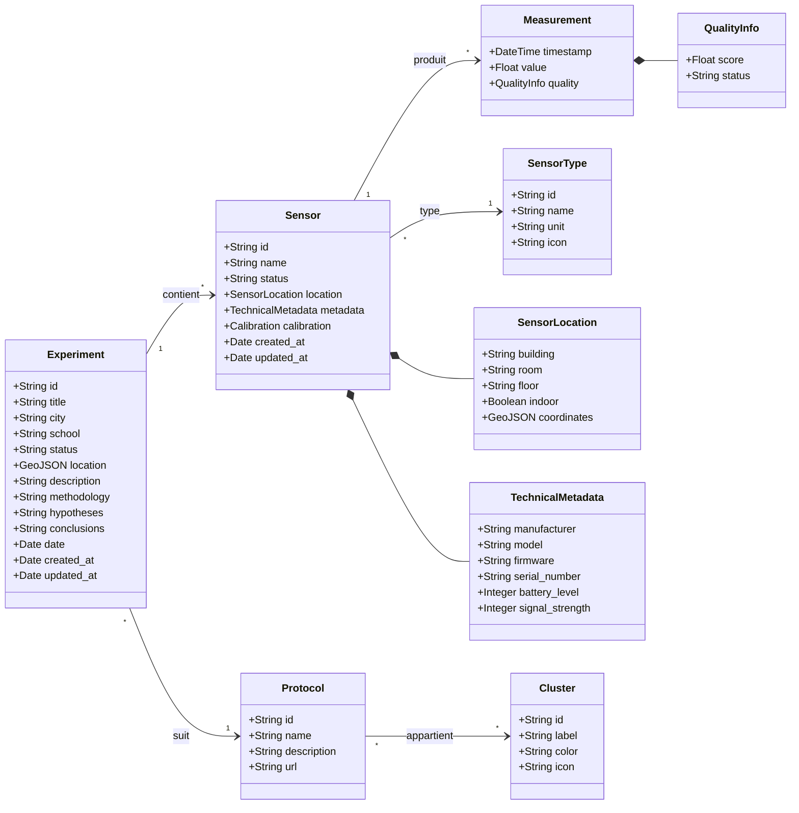

**Questions de réflexion :**

1. Quelles informations sont nécessaires pour décrire une expérience ?
2. Quels attributs caractérisent un capteur IoT ?
3. Comment stocker efficacement des millions de mesures ?
4. Quelles données faut-il dénormaliser pour la performance ?

##### 💡 Conseils :

Pensez aux patterns vus en TP3 :
- **Embedding vs Référencement** : Les mesures doivent-elles être dans le document capteur ?
- **Bucket Pattern** : Comment grouper les mesures par période ?
- **Computed Pattern** : Quelles statistiques pré-calculer ?


####  Conception des collections

Créez un fichier `packages/shared/schemas.js` définissant vos collections MongoDB (ces schémas seront partagés entre l'API pour la validation et les scripts).

**Collection `experiments` (expériences)**

Une expérience représente un projet scientifique mené par une école. Elle est rattachée à un **cluster** (thématique) :

| Cluster         | Description                 | Couleur suggérée |
|-----------------|-----------------------------|------------------|
| `environmental` | Qualité de l'air, pollution | 🟢 Vert          |
| `energy`        | Consommation énergétique    | 🟠 Orange        |
| `mobility`      | Transports, déplacements    | 🔵 Bleu          |
| `governance`    | Participation citoyenne     | 🟣 Violet        |
| `technology`    | Innovation, IA              | 🔴 Rouge         |

Chaque éxpérience est associé à un **protocole** expérimental donné. Le liste des protocoles du projet SteamCity est accessible ici : 
<https://github.com/steamcity/inquiries/tree/main/protocoles_liste_complete>

Un même protocole peut appartenir à plusieurs clusters.

**Schéma attendu :**

```javascript
// TODO: Complétez ce schéma
const experimentSchema = {
  _id: ObjectId,
  id: String,           // Identifiant métier (ex: "exp-001")
  title: String,        // Titre de l'expérience
  // ... à compléter

  // Pensez à :
  // - La localisation (ville, école, coordonnées GPS)
  // - Le cluster (thématique) et le protocole expérimental
  // - Le statut (active, completed, paused)
  // - Les dates importantes
  // - La description, méthodologie, hypothèses, conclusions
}
```

**Collection `sensor_devices` (capteurs)**

Un capteur est un dispositif physique déployé dans le cadre d'une expérience.

```javascript
// TODO: Complétez ce schéma
const sensorDeviceSchema = {
  _id: ObjectId,
  id: String,
  name: String,
  sensor_type_id: String,     // Référence vers sensor_types
  experiment_id: String,       // Référence vers experiments
  status: String,              // online, offline, maintenance
  // ... à compléter

  // Pensez à :
  // - La localisation (bâtiment, salle, coordonnées)
  // - Les métadonnées techniques (fabricant, modèle, firmware)
  // - La calibration
}
```

**Collection `sensor_types` (types de capteurs)**

Référentiel des types de capteurs supportés :

| Type          | Nom                    | Icône | Unité  | Plage typique   |
|---------------|------------------------|-------|--------|-----------------|
| `temperature` | Température            | 🌡️    | °C     | -40 à 85        |
| `humidity`    | Humidité               | 💧    | %      | 0 à 100         |
| `co2`         | CO2                    | 🌬️    | ppm    | 0 à 10000       |
| `noise`       | Niveau sonore          | 🔊    | dB     | 0 à 140         |
| `pm25`        | Particules fines PM2.5 | 🫁    | μg/m³  | 0 à 500         |
| `pm10`        | Particules PM10        | 🌫️    | μg/m³  | 0 à 1000        |
| `light`       | Luminosité             | 💡    | lux    | 0 à 100000      |
| `pressure`    | Pression               | 🌤️    | hPa    | 800 à 1200      |
| `motion`      | Mouvement              | 🏃    | bool   | présence/absence|
| `door`        | Ouverture              | 🚪    | bool   | ouvert/fermé    |

**Collection `measurements` (mesures)**

Les mesures sont le cœur du système. Chaque mesure représente une valeur captée à un instant donné.

```javascript
// TODO: Concevez ce schéma en appliquant le Bucket Pattern si approprié
const measurementSchema = {
  // Réfléchissez :
  // - Faut-il stocker chaque mesure individuellement ?
  // - Comment optimiser les requêtes temporelles ?
  // - Quelles statistiques pré-calculer ?
}
```

##### ✅ Validation : Checklist de conception

Votre modélisation doit permettre de répondre efficacement à ces requêtes :
- [ ] Lister toutes les expériences d'un cluster donné
- [ ] Trouver les capteurs actifs d'une expérience
- [ ] Récupérer les mesures des dernières 24h d'un capteur
- [ ] Calculer la moyenne de température sur une période
- [ ] Afficher les expériences sur une carte (coordonnées GPS)

#### Création des index

Créez un fichier `packages/scripts/create-indexes.js` pour créer les index nécessaires.

```javascript
// packages/scripts/create-indexes.js
require('dotenv').config({ path: '../../.env' });
const { MongoClient } = require('mongodb');

const uri = process.env.MONGODB_URI;
const dbName = process.env.DB_NAME || 'iot_platform';

async function createIndexes() {
  const client = new MongoClient(uri);

  try {
    await client.connect();
    const db = client.db(dbName);

    console.log('📊 Création des index...');

    // TODO: Définissez les index pour chaque collection

    // Index géospatial pour les coordonnées des expériences
    await db.collection('experiments').createIndex(
      { 'location': '2dsphere' }
    );
    console.log('✅ Index géospatial sur experiments.location');

    // Index sur le cluster pour le filtrage
    await db.collection('experiments').createIndex({ cluster_id: 1 });
    console.log('✅ Index sur experiments.cluster_id');

    // Index composé pour les capteurs
    await db.collection('sensor_devices').createIndex({
      experiment_id: 1,
      status: 1
    });
    console.log('✅ Index composé sur sensor_devices');

    // Index composé pour les mesures (requêtes temporelles)
    await db.collection('measurements').createIndex({
      experiment_id: 1,
      timestamp: -1
    });
    await db.collection('measurements').createIndex({
      sensor_id: 1,
      timestamp: -1
    });
    console.log('✅ Index composés sur measurements');

    // Optionnel : Index TTL pour purge automatique (90 jours)
    // await db.collection('measurements').createIndex(
    //   { timestamp: 1 },
    //   { expireAfterSeconds: 90 * 24 * 60 * 60 }
    // );

    console.log('\n🎉 Tous les index ont été créés !');

  } finally {
    await client.close();
  }
}

createIndexes().catch(console.error);
```

---

### 1.2 API REST de base (1h30)

#### Configuration du monorepo

**Étape 1 : Créer la structure du projet**

```bash
# Créer le dossier racine et les packages
mkdir -p iot-platform/packages/{api,web,shared,scripts}
mkdir -p iot-platform/packages/api/src/{routes,services,plugins}
mkdir -p iot-platform/packages/web/{css,js}
mkdir -p iot-platform/{data,tests}
cd iot-platform
```

**Étape 2 : Initialiser le workspace racine**

Créez le fichier `package.json` à la racine :

```json
{
  "name": "iot-platform",
  "version": "1.0.0",
  "private": true,
  "description": "Plateforme IoT pédagogique - Monorepo",
  "workspaces": [
    "packages/*"
  ],
  "scripts": {
    "dev": "concurrently \"npm run dev -w @iot/api\" \"npm run dev -w @iot/web\"",
    "dev:api": "npm run dev -w @iot/api",
    "dev:web": "npm run dev -w @iot/web",
    "seed": "npm run seed -w @iot/scripts",
    "create-indexes": "npm run create-indexes -w @iot/scripts",
    "test": "npm run test -w @iot/api"
  },
  "devDependencies": {
    "concurrently": "^8.2.0"
  }
}
```

**Étape 3 : Configurer le package `@iot/shared`**

Créez `packages/shared/package.json` :

```json
{
  "name": "@iot/shared",
  "version": "1.0.0",
  "main": "index.js",
  "description": "Code partagé entre les packages"
}
```

Créez `packages/shared/constants.js` :

```javascript
// Clusters thématiques SteamCity (https://github.com/steamcity/steamcity_io/blob/main/data/clusters.json)
const CLUSTERS = {
  1: { id: 1, label: 'Governance and citizenship', color: 'blue', icon: '🏛️' },
  2: { id: 2, label: 'Environmental quality', color: 'green', icon: '🌿' },
  3: { id: 3, label: 'Mobility', color: 'red', icon: '🚗' },
  4: { id: 4, label: 'Energy savings', color: 'yellow', icon: '⚡' },
  5: { id: 5, label: 'AI and technologies', color: 'purple', icon: '🤖' }
};

// Protocoles expérimentaux SteamCity (https://github.com/steamcity/steamcity_io/blob/main/data/steamcity-protocols.js)
const PROTOCOLS = {
  'city-detective': { name: 'City Detective Challenge', category: 'Data Analysis' },
  'data-storytelling': { name: 'Data Storytelling', category: 'Data Analysis' },
  'open-data-explorer': { name: 'Open Data Explorer', category: 'Data Analysis' },
  'sound-mapping': { name: 'Sound Mapping', category: 'Sound' },
  'noise-pollution': { name: 'Noise Pollution Investigation', category: 'Sound' },
  'soundscape-ecology': { name: 'Soundscape Ecology', category: 'Sound' },
  'air-quality-monitoring': { name: 'Air Quality Monitoring', category: 'Air Quality' },
  'pollution-sources': { name: 'Pollution Sources Investigation', category: 'Air Quality' },
  'energy-audit': { name: 'Energy Audit', category: 'Energy' },
  'renewable-energy': { name: 'Renewable Energy Assessment', category: 'Energy' },
  'energy-consumption': { name: 'Energy Consumption Patterns', category: 'Energy' },
  'light-pollution': { name: 'Light Pollution Study', category: 'Light' },
  'natural-lighting': { name: 'Natural Lighting Optimization', category: 'Light' },
  'urban-biodiversity': { name: 'Urban Biodiversity Survey', category: 'Biodiversity' },
  'pollinator-watch': { name: 'Pollinator Watch', category: 'Biodiversity' },
  'mobility-patterns': { name: 'Mobility Patterns Analysis', category: 'Mobility' },
  'active-transport': { name: 'Active Transport Promotion', category: 'Mobility' },
  'iot-basics': { name: 'IoT Basics', category: 'IoT' },
  'urban-heat-island': { name: 'Urban Heat Island Effect', category: 'Temperature' },
  'ai-image-recognition': { name: 'AI Image Recognition', category: 'AI' },
  'ml-prediction': { name: 'Machine Learning Prediction', category: 'AI' },
  'chatbot-development': { name: 'Chatbot Development', category: 'AI' },
  'ai-data-analysis': { name: 'AI-Assisted Data Analysis', category: 'AI' },
  'computer-vision': { name: 'Computer Vision for Cities', category: 'AI' }
};

// Types de capteurs supportés (https://github.com/steamcity/steamcity_io/blob/main/data/sensor-types.json)
const SENSOR_TYPES = {
  temperature: { name: 'Température', icon: '🌡️', unit: '°C', range: [-40, 85], precision: 0.1 },
  humidity: { name: 'Humidité', icon: '💧', unit: '%', range: [0, 100], precision: 0.5 },
  co2: { name: 'CO2', icon: '🌬️', unit: 'ppm', range: [0, 10000], precision: 1 },
  noise: { name: 'Niveau sonore', icon: '🔊', unit: 'dB', range: [0, 140], precision: 0.1 },
  pm25: { name: 'PM2.5', icon: '🫁', unit: 'μg/m³', range: [0, 500], precision: 0.1 },
  pm10: { name: 'PM10', icon: '🌫️', unit: 'μg/m³', range: [0, 1000], precision: 0.1 },
  light: { name: 'Luminosité', icon: '💡', unit: 'lux', range: [0, 100000], precision: 1 },
  pressure: { name: 'Pression', icon: '🌤️', unit: 'hPa', range: [800, 1200], precision: 0.1 },
  motion: { name: 'Mouvement', icon: '🏃', unit: 'bool', type: 'boolean' },
  door: { name: 'Ouverture', icon: '🚪', unit: 'bool', type: 'boolean' }
};

// Statuts des capteurs
const SENSOR_STATUS = {
  online: { label: 'En ligne', color: '#27ae60' },
  offline: { label: 'Hors ligne', color: '#e74c3c' },
  maintenance: { label: 'Maintenance', color: '#f39c12' }
};

module.exports = { CLUSTERS, PROTOCOLS, SENSOR_TYPES, SENSOR_STATUS };
```

Créez `packages/shared/index.js` :

```javascript
const { CLUSTERS, PROTOCOLS, SENSOR_TYPES, SENSOR_STATUS } = require('./constants');

module.exports = {
  CLUSTERS,
  PROTOCOLS,
  SENSOR_TYPES,
  SENSOR_STATUS
};

// Vous pourrez ajouter d'autres exports au fur et à mesure :
// const schemas = require('./schemas');
// const utils = require('./utils');
```

> **Note** : Les fichiers `schemas.js` et `utils.js` sont à créer par vos soins selon vos besoins. Vous pouvez y centraliser vos schémas de validation et fonctions utilitaires.

**Étape 4 : Configurer le package `@iot/api`**

Créez `packages/api/package.json` :

```json
{
  "name": "@iot/api",
  "version": "1.0.0",
  "description": "API Backend Fastify",
  "main": "src/app.js",
  "scripts": {
    "dev": "nodemon src/app.js",
    "start": "node src/app.js"
  },
  "dependencies": {
    "@fastify/cors": "^9.0.0",
    "@iot/shared": "*",
    "dotenv": "^16.3.0",
    "fastify": "^4.24.0",
    "mongodb": "^6.3.0"
  },
  "devDependencies": {
    "nodemon": "^3.0.0"
  }
}
```

**Étape 5 : Configurer le package `@iot/web`**

Créez `packages/web/package.json` :

```json
{
  "name": "@iot/web",
  "version": "1.0.0",
  "description": "Frontend Web",
  "scripts": {
    "dev": "npx serve -l 5000 .",
    "start": "npx serve -l 5000 ."
  },
  "devDependencies": {
    "serve": "^14.2.0"
  }
}
```

**Étape 6 : Configurer le package `@iot/scripts`**

Créez `packages/scripts/package.json` :

```json
{
  "name": "@iot/scripts",
  "version": "1.0.0",
  "description": "Scripts utilitaires",
  "scripts": {
    "seed": "node seed.js",
    "create-indexes": "node create-indexes.js"
  },
  "dependencies": {
    "@iot/shared": "*",
    "dotenv": "^16.3.0",
    "mongodb": "^6.3.0"
  }
}
```

**Étape 7 : Installer les dépendances**

```bash
# À la racine du projet
npm install
```

> **Note** : npm workspaces installe automatiquement les dépendances de tous les packages et crée les liens symboliques pour les packages internes (`@iot/shared`).

**Configuration de la base de données (`packages/api/src/services/database.js`) :**

```javascript
const { MongoClient } = require('mongodb');

let db = null;

async function connectDB() {
  // TODO: Implémenter la connexion à MongoDB Atlas
  // Utilisez les variables d'environnement pour les credentials
}

function getDB() {
  if (!db) {
    throw new Error('Database not initialized. Call connectDB first.');
  }
  return db;
}

module.exports = { connectDB, getDB };
```

#### Endpoints CRUD pour les expériences

Implémentez les endpoints suivants dans `src/routes/experiments.js` :

| Méthode  | Endpoint               | Description                  |
|----------|------------------------|------------------------------|
| `GET`    | `/api/experiments`     | Liste toutes les expériences |
| `GET`    | `/api/experiments/:id` | Détail d'une expérience      |
| `POST`   | `/api/experiments`     | Créer une expérience         |
| `PUT`    | `/api/experiments/:id` | Modifier une expérience      |
| `DELETE` | `/api/experiments/:id` | Supprimer une expérience     |

**Format de réponse attendu :**

```javascript
// Succès (liste)
{
  "success": true,
  "count": 10,
  "data": [/* array d'expériences */]
}

// Succès (détail)
{
  "success": true,
  "data": {/* objet expérience */}
}

// Erreur
{
  "success": false,
  "error": "Message d'erreur explicite"
}
```

##### 💡 Exemple de squelette pour GET /api/experiments</summary>

```javascript
// packages/api/src/routes/experiments.js
const { getDB } = require('../services/database');
const { CLUSTERS } = require('@iot/shared');  // Import depuis le package partagé

async function experimentsRoutes(fastify, options) {

  // GET /api/experiments
  fastify.get('/', async (request, reply) => {
    try {
      const db = getDB();
      const { cluster_id } = request.query;  // Filtre optionnel

      const filter = cluster_id ? { cluster_id: Number(cluster_id) } : {};
      const experiments = await db.collection('experiments')
        .find(filter)
        .toArray();

      return {
        success: true,
        count: experiments.length,
        data: experiments
      };
    } catch (error) {
      reply.status(500);
      return {
        success: false,
        error: error.message
      };
    }
  });

  // GET /api/experiments/:id
  fastify.get('/:id', async (request, reply) => {
    try {
      const db = getDB();
      const experiment = await db.collection('experiments')
        .findOne({ id: request.params.id });

      if (!experiment) {
        reply.status(404);
        return { success: false, error: 'Expérience non trouvée' };
      }

      return { success: true, data: experiment };
    } catch (error) {
      reply.status(500);
      return { success: false, error: error.message };
    }
  });

  // POST /api/experiments
  fastify.post('/', async (request, reply) => {
    try {
      const db = getDB();

      // Validation du cluster avec les constantes partagées
      if (request.body.cluster_id && !CLUSTERS[request.body.cluster_id]) {
        reply.status(400);
        return {
          success: false,
          error: `Cluster invalide. Valeurs autorisées: ${Object.keys(CLUSTERS).join(', ')}`
        };
      }

      const experiment = {
        ...request.body,
        created_at: new Date(),
        updated_at: new Date()
      };

      await db.collection('experiments').insertOne(experiment);

      reply.status(201);
      return { success: true, data: experiment };
    } catch (error) {
      reply.status(500);
      return { success: false, error: error.message };
    }
  });
}

module.exports = experimentsRoutes;
```

#### Endpoints pour les capteurs

Implémentez dans `packages/api/src/routes/sensors.js` :

| Méthode | Endpoint                   | Description                         |
|---------|----------------------------|-------------------------------------|
| `GET`   | `/api/sensors/types`       | Liste des types de capteurs         |
| `GET`   | `/api/sensors/devices`     | Liste des capteurs (avec filtres)   |
| `GET`   | `/api/sensors/devices/:id` | Détail d'un capteur                 |

**Paramètres de filtre pour `/api/sensors/devices` :**

```
GET /api/sensors/devices?experimentId=exp-001&status=online&type=temperature
```

#### Endpoints pour les mesures

Implémentez dans `packages/api/src/routes/measurements.js` :

| Méthode | Endpoint                    | Description                          |
|---------|-----------------------------|--------------------------------------|
| `GET`   | `/api/sensors/measurements` | Récupérer les mesures (avec filtres) |
| `POST`  | `/api/sensors/measurements` | Enregistrer une nouvelle mesure      |

**Paramètres de filtre pour GET :**

| Paramètre      | Type   | Description                |
|----------------|--------|----------------------------|
| `sensorId`     | String | Filtrer par capteur        |
| `experimentId` | String | Filtrer par expérience     |
| `period`       | String | `24h`, `7d`, `30d`, `all`  |
| `from`         | Date   | Date de début (format ISO) |
| `to`           | Date   | Date de fin (format ISO)   |
| `limit`        | Number | Nombre max de résultats    |


#### 💡 Calcul des périodes

```javascript
function getDateRange(period) {
  const now = new Date();
  let from;

  switch (period) {
    case '24h':
      from = new Date(now - 24 * 60 * 60 * 1000);
      break;
    case '7d':
      from = new Date(now - 7 * 24 * 60 * 60 * 1000);
      break;
    case '30d':
      from = new Date(now - 30 * 24 * 60 * 60 * 1000);
      break;
    default:
      from = null; // Toutes les données
  }

  return { from, to: now };
}
```

#### Endpoint de santé

Implémentez un endpoint de vérification :

```javascript
// GET /api/health
{
  "success": true,
  "status": "healthy",
  "timestamp": "2025-01-15T10:30:00Z",
  "database": "connected"
}
```

---

### 1.3 Infrastructure technique (1h)

#### Données de test

Créez un fichier `data/sample-data.json` ou un script `scripts/seed.js` pour peupler votre base avec des données réalistes.

**Données minimales requises :**
- 3 à 5 expériences de protocoles différents
- 2 à 4 capteurs par expérience
- 50 à 100 mesures par capteur (sur plusieurs jours)

#### 💡 Script de génération de données

```javascript
// packages/scripts/seed.js
require('dotenv').config({ path: '../../.env' });
const { MongoClient } = require('mongodb');
const { CLUSTERS, PROTOCOLS, SENSOR_TYPES } = require('@iot/shared');

const uri = process.env.MONGODB_URI;
const dbName = process.env.DB_NAME || 'iot_platform';

const cities = ['Aix-en-Provence', 'Marseille', 'Toulon', 'Nice', 'Avignon'];
const schools = ['Victor Hugo', 'Marie Curie', 'Jean Moulin', 'Albert Camus', 'Émile Zola'];
const clusterIds = Object.keys(CLUSTERS).map(Number);
const protocolIds = Object.keys(PROTOCOLS);
const sensorTypeKeys = Object.keys(SENSOR_TYPES);

function generateExperiments(count = 5) {
  return Array.from({ length: count }, (_, i) => {
    const clusterId = clusterIds[i % clusterIds.length];
    const protocolId = protocolIds[i % protocolIds.length];
    return {
      id: `exp-${String(i + 1).padStart(3, '0')}`,
      title: `${PROTOCOLS[protocolId].name} - ${schools[i % schools.length]}`,
      city: cities[i % cities.length],
      school: `Lycée ${schools[i % schools.length]}`,
      cluster_id: clusterId,
      cluster_name: CLUSTERS[clusterId].label,
      protocol_id: protocolId,
      protocol_name: PROTOCOLS[protocolId].name,
      location: {
        type: 'Point',
        coordinates: [5.4 + Math.random() * 0.2, 43.3 + Math.random() * 0.2]
      },
      status: 'active',
      date: new Date().toISOString().split('T')[0],
      description: `Expérience "${PROTOCOLS[protocolId].name}" menée dans l'établissement.`,
      methodology: 'Collecte de données via capteurs IoT sur une période de 30 jours.',
      hypotheses: 'Les variations observées sont corrélées aux activités humaines.',
      created_at: new Date(),
      updated_at: new Date()
    };
  });
}

function generateSensors(experiments) {
  const sensors = [];
  experiments.forEach((exp, expIndex) => {
    // 2-4 capteurs par expérience
    const sensorCount = 2 + Math.floor(Math.random() * 3);
    for (let i = 0; i < sensorCount; i++) {
      const typeKey = sensorTypeKeys[(expIndex + i) % sensorTypeKeys.length];
      sensors.push({
        id: `sensor-${exp.id}-${i + 1}`,
        name: `Capteur ${SENSOR_TYPES[typeKey].name} - ${exp.school}`,
        sensor_type_id: typeKey,
        experiment_id: exp.id,
        status: ['online', 'online', 'online', 'maintenance'][Math.floor(Math.random() * 4)],
        description: `Capteur ${SENSOR_TYPES[typeKey].name} installé dans le cadre de ${exp.title}`,
        location: {
          building: `Bâtiment ${String.fromCharCode(65 + (i % 3))}`,
          room: `Salle ${100 + i * 10}`,
          floor: `${i + 1}er étage`,
          indoor: true
        },
        metadata: {
          manufacturer: 'Sensirion',
          model: `Model-${typeKey.toUpperCase()}`,
          battery_level: 50 + Math.floor(Math.random() * 50),
          signal_strength: -40 - Math.floor(Math.random() * 40)
        },
        created_at: new Date(),
        updated_at: new Date()
      });
    }
  });
  return sensors;
}

function generateMeasurements(sensors, daysBack = 7) {
  const measurements = [];
  const now = Date.now();

  sensors.forEach(sensor => {
    const type = SENSOR_TYPES[sensor.sensor_type_id];
    // Générer des mesures toutes les heures sur les X derniers jours
    for (let d = 0; d < daysBack * 24; d++) {
      const timestamp = new Date(now - d * 60 * 60 * 1000);
      let value;

      // Valeurs réalistes selon le type
      switch (sensor.sensor_type_id) {
        case 'temperature': value = 18 + Math.random() * 8; break;
        case 'humidity': value = 30 + Math.random() * 40; break;
        case 'co2': value = 400 + Math.random() * 600; break;
        case 'noise': value = 30 + Math.random() * 40; break;
        case 'pm25': value = 5 + Math.random() * 25; break;
        case 'light': value = 100 + Math.random() * 500; break;
        default: value = Math.random() * 100;
      }

      measurements.push({
        sensor_id: sensor.id,
        sensor_type_id: sensor.sensor_type_id,
        experiment_id: sensor.experiment_id,
        timestamp,
        value: Math.round(value * 100) / 100,
        quality: { score: 0.9 + Math.random() * 0.1, status: 'good' }
      });
    }
  });
  return measurements;
}

async function seed() {
  const client = new MongoClient(uri);

  try {
    await client.connect();
    console.log('📦 Connexion à MongoDB...');

    const db = client.db(dbName);

    // Nettoyer les collections
    console.log('🧹 Nettoyage des collections...');
    await db.collection('experiments').deleteMany({});
    await db.collection('sensor_devices').deleteMany({});
    await db.collection('sensor_types').deleteMany({});
    await db.collection('measurements').deleteMany({});

    // Générer et insérer les données
    const experiments = generateExperiments(5);
    const sensors = generateSensors(experiments);
    const measurements = generateMeasurements(sensors, 7);

    // Insérer les types de capteurs
    const sensorTypesData = Object.entries(SENSOR_TYPES).map(([id, data]) => ({
      id,
      ...data
    }));
    await db.collection('sensor_types').insertMany(sensorTypesData);
    console.log(`✅ ${sensorTypesData.length} types de capteurs insérés`);

    await db.collection('experiments').insertMany(experiments);
    console.log(`✅ ${experiments.length} expériences insérées`);

    await db.collection('sensor_devices').insertMany(sensors);
    console.log(`✅ ${sensors.length} capteurs insérés`);

    await db.collection('measurements').insertMany(measurements);
    console.log(`✅ ${measurements.length} mesures insérées`);

    console.log('\n🎉 Base de données initialisée avec succès !');

  } finally {
    await client.close();
  }
}

seed().catch(console.error);
```

#### Serveur Fastify

Complétez `packages/api/src/app.js` pour lancer le serveur :

```javascript
// packages/api/src/app.js
require('dotenv').config({ path: '../../.env' });
const fastify = require('fastify')({ logger: true });
const { connectDB } = require('./services/database');

const PORT = process.env.API_PORT || 3000;

async function buildServer() {
  // Plugin CORS
  await fastify.register(require('@fastify/cors'), {
    origin: true  // Autorise toutes les origines en dev
  });

  // Routes API
  await fastify.register(require('./routes/experiments'), { prefix: '/api/experiments' });
  await fastify.register(require('./routes/sensors'), { prefix: '/api/sensors' });
  await fastify.register(require('./routes/measurements'), { prefix: '/api/sensors/measurements' });

  // Health check
  fastify.get('/api/health', async (request, reply) => {
    return {
      success: true,
      status: 'healthy',
      timestamp: new Date().toISOString(),
      database: 'connected'
    };
  });

  // Route pour récupérer les constantes partagées (utile pour le frontend)
  fastify.get('/api/config', async (request, reply) => {
    const { CLUSTERS, PROTOCOLS, SENSOR_TYPES, SENSOR_STATUS } = require('@iot/shared');
    return {
      success: true,
      data: { CLUSTERS, PROTOCOLS, SENSOR_TYPES, SENSOR_STATUS }
    };
  });

  return fastify;
}

// Démarrage
async function start() {
  try {
    await connectDB();
    const server = await buildServer();

    await server.listen({ port: PORT, host: '0.0.0.0' });
    console.log(`🚀 Serveur Fastify démarré sur http://localhost:${PORT}`);
  } catch (error) {
    console.error('Erreur de démarrage:', error);
    process.exit(1);
  }
}

start();
```

> **Note** : Le frontend (sur le port 5000) et l'API (sur le port 3000) tournent séparément. Le CORS est configuré pour permettre les requêtes cross-origin.

**Fichier d'environnement `.env` à la racine :**

```bash
# .env (à la racine du monorepo)
MONGODB_URI=mongodb+srv://<user>:<password>@cluster.mongodb.net/
DB_NAME=iot_platform
API_PORT=3000
```

#### Test de l'API

Utilisez l'extension REST Client de VS Code ou Postman pour tester vos endpoints.

Créez un fichier `tests/api.http` :

```http
### Health Check
GET http://localhost:3000/api/health

### Liste des expériences
GET http://localhost:3000/api/experiments

### Détail d'une expérience
GET http://localhost:3000/api/experiments/exp-001

### Créer une expérience
POST http://localhost:3000/api/experiments
Content-Type: application/json

{
  "id": "exp-new",
  "title": "Nouvelle expérience",
  "city": "Aix-en-Provence",
  "cluster_id": 2
}

### Liste des capteurs d'une expérience
GET http://localhost:3000/api/sensors/devices?experimentId=exp-001

### Mesures des dernières 24h
GET http://localhost:3000/api/sensors/measurements?experimentId=exp-001&period=24h
```

### ✅ Validation Phase 1

Avant de passer à la Phase 2, vérifiez que :
- [ ] Votre base MongoDB contient des données de test
- [ ] Les 3 collections principales sont créées avec les bons index
- [ ] Tous les endpoints API retournent des données au bon format
- [ ] Le endpoint `/api/health` confirme la connexion à la base

---

## 🚀 Phase 2 : MVP (4h)

> **Objectif** : Créer une interface utilisateur fonctionnelle avec la carte interactive et la gestion des expériences.

### 2.1 Structure du frontend (30min)

Mettez en place la structure HTML/CSS/JS de base pour votre application single-page.

**Travail attendu :**
- Créer le fichier `index.html` avec la structure de navigation (header, menu, zones de contenu)
- Mettre en place les fichiers CSS de base (`styles.css`)
- Créer le fichier `config.js` pour centraliser l'URL de l'API et les constantes
- Créer le fichier `api.js` avec les fonctions d'appel à votre API REST

**Pistes :**
- Utilisez `fetch()` pour les appels API avec gestion des erreurs
- Récupérez les constantes partagées via l'endpoint `/api/config`
- Pensez à structurer votre CSS avec des classes réutilisables (`.card`, `.btn`, `.badge`, etc.)

**Documentation :**
- [Fetch API - MDN](https://developer.mozilla.org/fr/docs/Web/API/Fetch_API/Using_Fetch)
- [CSS Grid Layout - MDN](https://developer.mozilla.org/fr/docs/Web/CSS/CSS_grid_layout)
- [CSS Flexbox - MDN](https://developer.mozilla.org/fr/docs/Web/CSS/CSS_flexible_box_layout)

### 2.2 Vue Carte interactive (1h30)

Implémentez une carte interactive affichant les expériences géolocalisées avec Leaflet.js.

**Travail attendu :**
- Intégrer Leaflet.js dans votre page
- Afficher une carte centrée sur la région PACA
- Placer des marqueurs pour chaque expérience (coordonnées GPS)
- Colorer les marqueurs selon le cluster (utiliser les couleurs de `CLUSTERS`)
- Afficher une popup au clic avec les informations de base de l'expérience
- Créer une légende interactive permettant de filtrer par cluster

**Pistes :**
- Utilisez `L.circleMarker()` pour des marqueurs colorés personnalisables
- Groupez les marqueurs par cluster avec `L.layerGroup()` pour faciliter le filtrage
- La popup peut contenir un lien vers le détail de l'expérience
- Pensez à gérer le cas où une expérience n'a pas de coordonnées

**Documentation :**
- [Leaflet Quick Start Guide](https://leafletjs.com/examples/quick-start/)
- [Leaflet Markers](https://leafletjs.com/reference.html#marker)
- [Leaflet Circle Markers](https://leafletjs.com/reference.html#circlemarker)
- [Leaflet Layer Groups](https://leafletjs.com/reference.html#layergroup)
- [Leaflet Popups](https://leafletjs.com/reference.html#popup)

**Exemples de rendu :**

| Vue carte avec marqueurs | Popup de détail |
|:------------------------:|:---------------:|
| 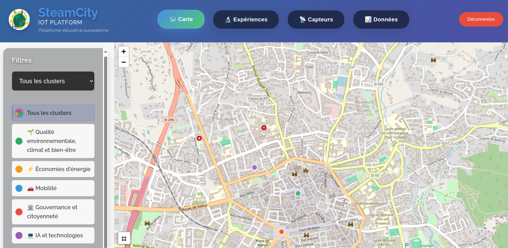 | 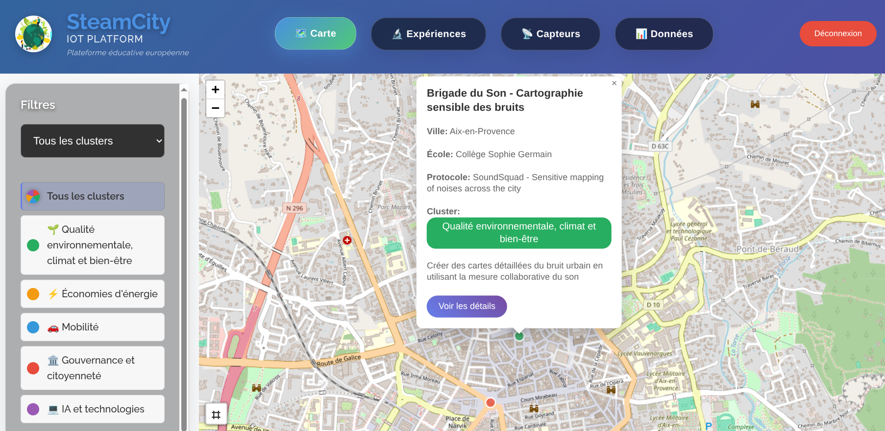 |

### 2.3 Vue Expériences (1h30)

Créez la vue liste et détail des expériences.

**Travail attendu :**
- Afficher la liste des expériences sous forme de cartes
- Permettre le filtrage par cluster et la recherche par nom/ville
- Implémenter la vue détail d'une expérience
- Afficher les capteurs associés à chaque expérience
- Permettre la navigation vers le détail d'un capteur

**Pistes :**
- Utilisez les badges colorés pour identifier visuellement les clusters
- Affichez un indicateur de statut pour chaque expérience (active, terminée, en pause)
- Récupérez les capteurs associés via `/api/sensors/devices?experimentId=...`
- Pensez à afficher un état de chargement pendant les requêtes API

**Exemples de rendu :**

| Filtres par cluster | Liste des expériences |
|:---------------------:|:---------------------:|
| 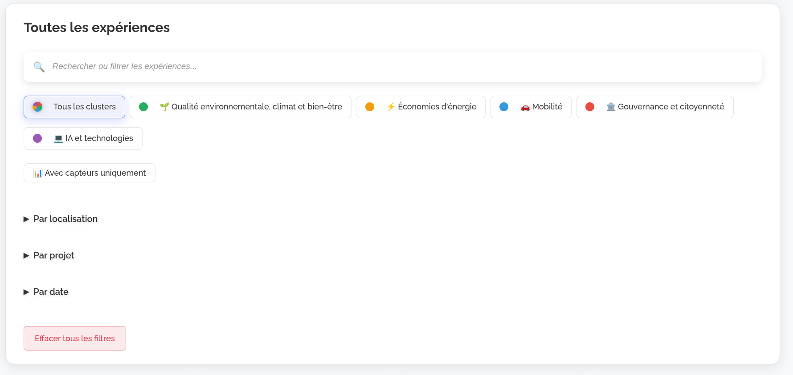 | 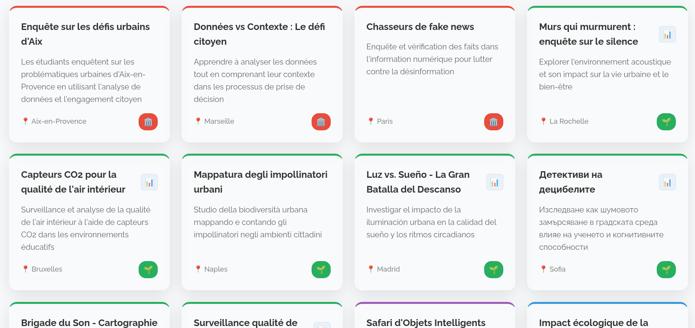 |

| Vue détail (partie haute) | Vue détail (capteurs associés) |
|:-------------------------:|:------------------------------:|
| 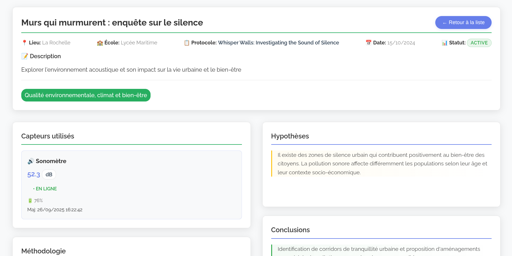 | 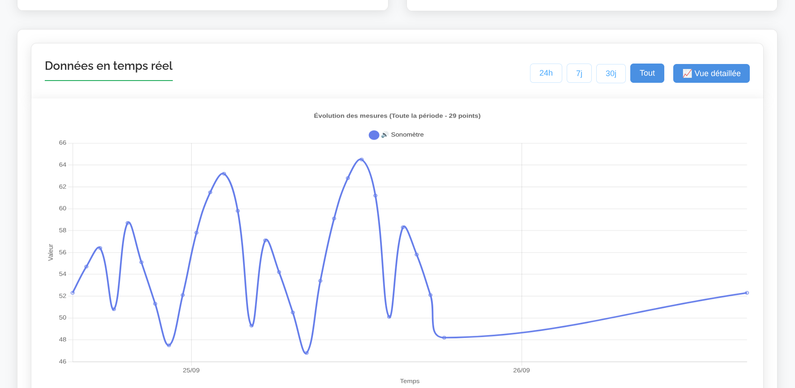 |

### 2.4 Navigation et routage (30min)

Implémentez un système de navigation simple pour votre application single-page.

**Travail attendu :**
- Créer un routeur JavaScript simple basé sur le hash de l'URL (`#/carte`, `#/experiences`, etc.)
- Mettre à jour l'URL lors de la navigation entre vues
- Gérer le bouton retour du navigateur
- Afficher la vue correspondante à l'URL au chargement de la page

**Pistes :**
- Écoutez l'événement `hashchange` sur `window`
- Utilisez `window.location.hash` pour lire et modifier l'URL
- Créez une fonction `navigateTo(route)` réutilisable
- Masquez/affichez les sections avec des classes CSS (`.hidden { display: none; }`)

**Routes suggérées :**
```
#/map                      → Vue carte
#/experiments              → Liste des expériences
#/experiments/:id          → Détail d'une expérience
#/sensors                  → Liste des capteurs
#/sensors/:id              → Détail d'un capteur
#/data                     → Vue analyse des données
```

**Documentation :**
- [History API - MDN](https://developer.mozilla.org/fr/docs/Web/API/History_API)
- [Window: hashchange event - MDN](https://developer.mozilla.org/fr/docs/Web/API/Window/hashchange_event)

#### ✅ Validation Phase 2

Avant de passer à la Phase 3, vérifiez que :
- [ ] La carte affiche les marqueurs colorés des expériences
- [ ] La légende permet de filtrer par cluster
- [ ] Un clic sur un marqueur affiche une popup
- [ ] La liste des expériences s'affiche correctement
- [ ] Le détail d'une expérience montre les capteurs associés
- [ ] La navigation entre vues fonctionne (URL mise à jour)
- [ ] Le bouton retour du navigateur fonctionne


---

## 🎉 Phase 3 : Version 1.0 (4h)

> **Objectif** : Compléter l'application avec les vues Capteurs et Données, et finaliser l'expérience utilisateur.

### 3.1 Vue Capteurs (1h30)

Créez la vue liste et détail des capteurs avec visualisation des mesures.

**Travail attendu :**
- Afficher la liste des capteurs avec leur statut (en ligne, hors ligne, maintenance)
- Permettre le filtrage par type de capteur, statut et expérience
- Implémenter la vue détail d'un capteur
- Afficher un graphique de l'historique des mesures avec Chart.js
- Permettre de changer la période d'affichage (24h, 7 jours, 30 jours)

**Pistes :**
- Utilisez des indicateurs visuels pour le statut (pastilles colorées)
- Affichez la dernière valeur mesurée directement dans la liste
- Pour Chart.js, un graphique en ligne (`type: 'line'`) est adapté aux séries temporelles
- Pensez à formater les dates sur l'axe X de manière lisible

**Documentation :**
- [Chart.js - Getting Started](https://www.chartjs.org/docs/latest/getting-started/)
- [Chart.js - Line Chart](https://www.chartjs.org/docs/latest/charts/line.html)
- [Chart.js - Time Scale](https://www.chartjs.org/docs/latest/axes/cartesian/time.html)

**Exemples de rendu :**

| Filtres par type/statut | Liste des capteurs |
|:-----------------------:|:------------------:|
| 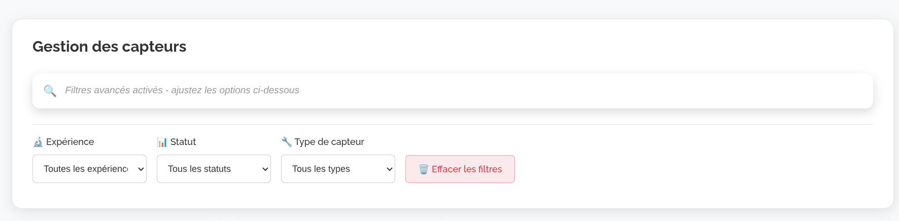 | 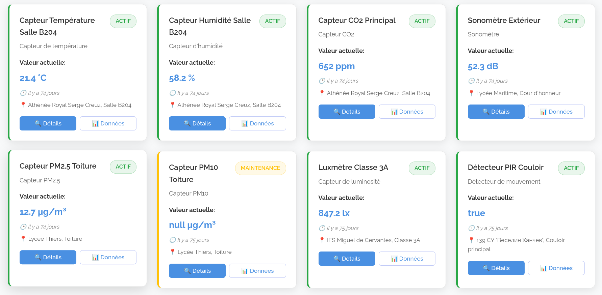 |

| Vue détail capteur | Graphique statistiques |
|:------------------:|:----------------------:|
| 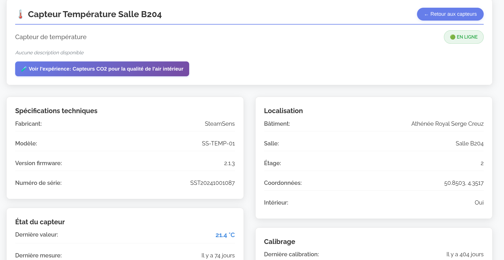 | 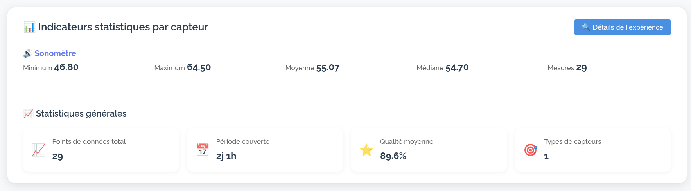 |

### 3.2 Vue Données / Analyse (1h30)

Créez une vue d'analyse permettant de visualiser et comparer les données de plusieurs capteurs.

**Travail attendu :**
- Permettre la sélection d'une expérience et de plusieurs capteurs
- Afficher des graphiques comparatifs (plusieurs séries sur un même graphique)
- Calculer et afficher des statistiques : moyenne, min, max, écart-type
- Permettre l'export des données (CSV ou JSON)
- Proposer différentes périodes d'analyse

**Pistes :**
- Utilisez les agrégations MongoDB côté API pour calculer les statistiques
- Chart.js permet d'afficher plusieurs datasets sur un même graphique
- Pour l'export CSV, construisez le fichier côté client et utilisez un lien de téléchargement
- Pensez à afficher un résumé textuel des statistiques en plus des graphiques

**Exemple d'agrégation MongoDB pour les statistiques :**
```javascript
db.measurements.aggregate([
  { $match: { sensor_id: "sensor-001", timestamp: { $gte: dateDebut } } },
  { $group: {
      _id: null,
      avg: { $avg: "$value" },
      min: { $min: "$value" },
      max: { $max: "$value" },
      count: { $sum: 1 }
  }}
])
```

**Documentation :**
- [Chart.js - Multiple Datasets](https://www.chartjs.org/docs/latest/charts/line.html#dataset-properties)
- [MongoDB Aggregation](https://www.mongodb.com/docs/manual/aggregation/)
- [Blob API pour l'export - MDN](https://developer.mozilla.org/fr/docs/Web/API/Blob)

**Exemples de rendu :**

| Filtres et sélection | Graphique comparatif |
|:--------------------:|:--------------------:|
| 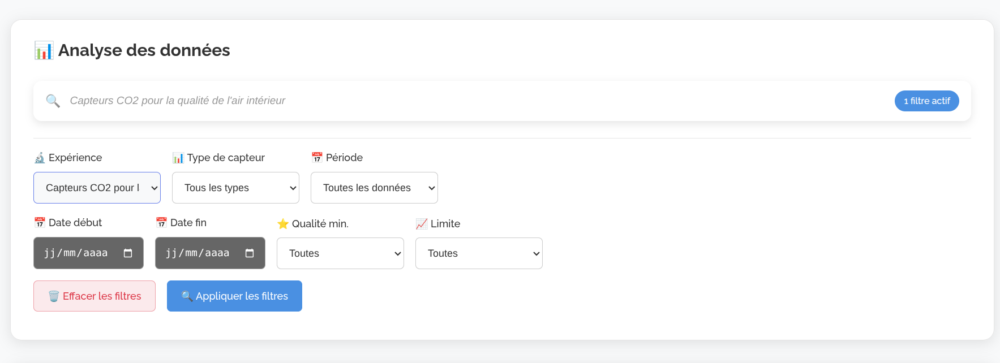 | 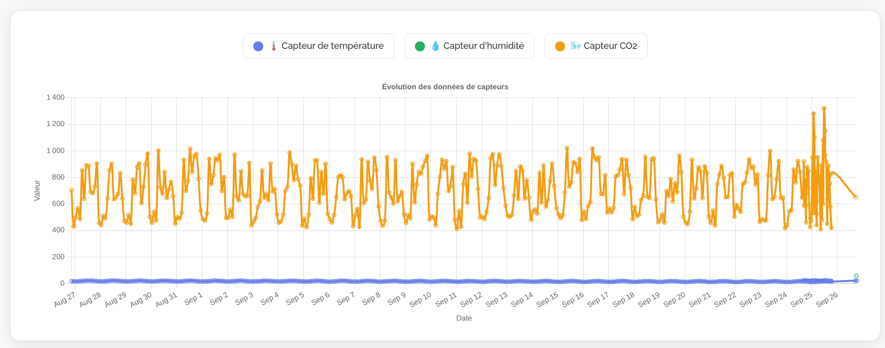 |

| Statistiques détaillées |
|:-----------------------:|
| 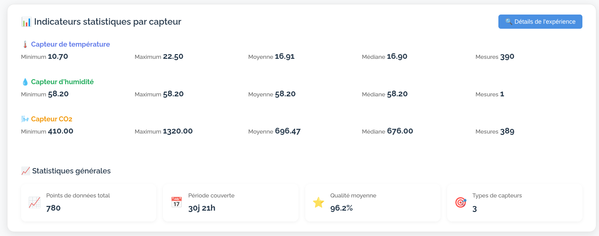 |

### 3.3 Finitions et améliorations (1h)

Peaufinez l'application pour offrir une expérience utilisateur agréable et robuste.

**Travail attendu :**
- Améliorer le design CSS (couleurs, espacements, typographie)
- Ajouter des états de chargement (spinners, skeletons)
- Gérer les erreurs de manière élégante (messages utilisateur, retry)
- Rendre l'interface responsive (mobile-friendly)
- Ajouter des transitions et animations subtiles

**Pistes :**
- Utilisez des variables CSS pour les couleurs et faciliter un éventuel mode sombre
- Affichez des messages d'erreur contextuels plutôt que des alertes
- Testez sur différentes tailles d'écran avec les DevTools
- Utilisez `@media queries` pour adapter la mise en page

**Améliorations bonus possibles :**
- Mode sombre
- Recherche globale dans toutes les entités
- Import de données depuis un fichier CSV
- Notifications en temps réel (polling ou WebSocket)
- Export PDF des rapports

**Documentation :**
- [CSS Variables - MDN](https://developer.mozilla.org/fr/docs/Web/CSS/Using_CSS_custom_properties)
- [Responsive Design - MDN](https://developer.mozilla.org/fr/docs/Learn/CSS/CSS_layout/Responsive_Design)
- [CSS Transitions - MDN](https://developer.mozilla.org/fr/docs/Web/CSS/CSS_transitions/Using_CSS_transitions)

#### ✅ Validation Phase 3

Avant de rendre votre projet, vérifiez que :
- [ ] La liste des capteurs s'affiche avec filtres fonctionnels
- [ ] Le détail d'un capteur affiche l'historique en graphique
- [ ] La vue données permet de comparer plusieurs capteurs
- [ ] Les statistiques sont calculées et affichées
- [ ] L'export de données fonctionne
- [ ] L'application est utilisable sur mobile
- [ ] Les erreurs sont gérées proprement

---

## 📊 Critères d'évaluation

### Barème détaillé (100 points)

| Critère                    | Points | Description                         |
|----------------------------|--------|-------------------------------------|
| **Phase 1 : Fondations**   | **30** |                                     |
| Modélisation MongoDB       | 10     | Schémas cohérents, index pertinents |
| API REST                   | 15     | Tous les endpoints fonctionnels     |
| Infrastructure             | 5      | Données de test, configuration      |
| **Phase 2 : MVP**          | **35** |                                     |
| Carte interactive          | 15     | Marqueurs, popups, filtres          |
| Vue Expériences            | 15     | Liste, détail, capteurs             |
| Navigation                 | 5      | Routage, URLs, UX                   |
| **Phase 3 : V1**           | **35** |                                     |
| Vue Capteurs               | 12     | Liste, filtres, détail              |
| Vue Données                | 15     | Graphiques, statistiques            |
| Finitions                  | 8      | CSS, UX, gestion erreurs            |

### Bonus (jusqu'à 15 points)

- Import CSV fonctionnel (+5)
- Recherche globale (+5)
- Mode sombre (+3)
- Tests automatisés (+5)

### Pénalités

- Code non fonctionnel : -5 à -20 selon gravité
- Absence de commentaires : -5
- Mauvaise gestion des erreurs : -5
- Code non structuré : -5

### Ajustement des notes

Le travail demandé est ambitieux et il est normal de ne pas tout terminer.

**Ce que cela signifie pour vous :**
- Votre note brute sera ajustée en fonction des résultats de l'ensemble de la promotion
- L'objectif est d'obtenir une distribution équilibrée (moyenne ~12, écart-type ~2)
- Plusieurs formules d'ajustement seront appliquées et **la meilleure note sera retenue**

> 💡 **En pratique** : concentrez-vous sur la qualité de ce que vous produisez plutôt que sur la quantité. Un projet partiel mais bien réalisé sera valorisé.

---

## 📚 Ressources

### Documentation officielle

- [MongoDB Manual](https://www.mongodb.com/docs/manual/)
- [Node.js MongoDB Driver](https://www.mongodb.com/docs/drivers/node/current/)
- [Fastify](https://fastify.dev/docs/latest/)
- [npm Workspaces](https://docs.npmjs.com/cli/using-npm/workspaces)
- [Leaflet.js](https://leafletjs.com/reference.html)
- [Chart.js](https://www.chartjs.org/docs/latest/)

### Commandes npm workspaces utiles

```bash
# Installer toutes les dépendances (à la racine)
npm install

# Lancer l'API et le frontend en parallèle
npm run dev

# Lancer uniquement l'API
npm run dev:api

# Lancer uniquement le frontend
npm run dev:web

# Exécuter le script de seed
npm run seed

# Ajouter une dépendance à un package spécifique
npm install lodash -w @iot/api

# Exécuter un script dans un package spécifique
npm run test -w @iot/api

# Lister tous les workspaces
npm ls --workspaces
```

### Rappels des TP précédents

- **TP1** : CRUD, opérateurs de mise à jour (`$set`, `$push`, `$pull`)
- **TP2** : Agrégations (`$match`, `$group`, `$project`, `$lookup`)
- **TP3** : Patterns (Bucket, Computed, CQRS)

### Outils recommandés

- **MongoDB Compass** : Interface graphique pour explorer vos données
- **VS Code + REST Client** : Tester vos endpoints API
- **DevTools** : Déboguer le frontend

---

## 🎯 Conseils pour réussir

1. **Commencez par la structure** : Créez d'abord tous les dossiers et fichiers `package.json` du monorepo
2. **Configurez le package shared en premier** : Les constantes partagées seront utilisées partout
3. **Testez chaque endpoint** : Validez votre API avant de passer au frontend
4. **Lancez API et frontend séparément** : Utilisez deux terminaux ou `npm run dev`
5. **Utilisez les patterns appris** : Bucket pour les mesures, Computed pour les statistiques
6. **Gérez les erreurs** : Une bonne gestion d'erreurs facilite le débogage
7. **Commitez régulièrement** : Faites des commits à chaque étape fonctionnelle

### Ordre de développement recommandé

```
1. Créer la structure monorepo (package.json racine + packages)
2. Configurer @iot/shared avec les constantes
3. Implémenter @iot/api (routes, services)
4. Tester l'API avec tests/api.http
5. Exécuter npm run seed pour avoir des données
6. Développer @iot/web (frontend)
7. Connecter frontend ↔ API
8. Finitions et CSS
```

---

<div align="center">

**Bon courage ! 🚀**

*N'hésitez pas à poser des questions à votre enseignant si vous êtes bloqués.*

</div>
